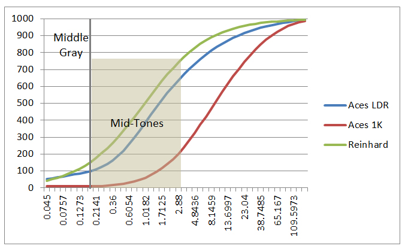
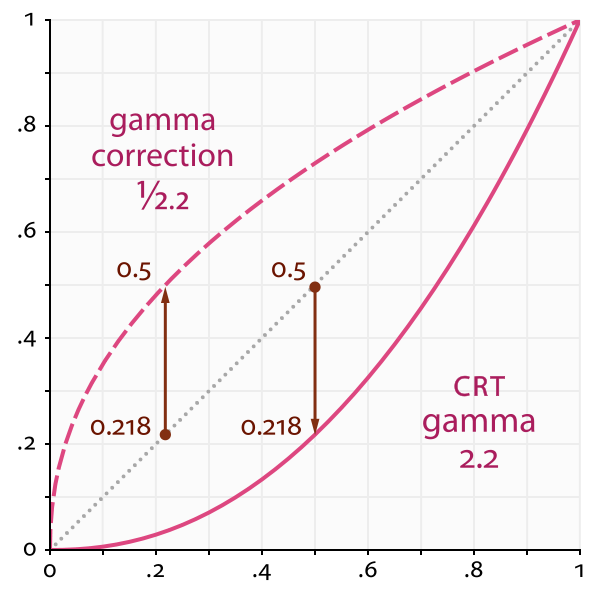

[](../)

## [](../main_page/GenAI)


**High Dynamic Range (HDR) Imaging: A Complete Tutorial**

---

## 🌟 Motivation: Why HDR?

Standard cameras and displays work in Standard Dynamic Range (SDR), which only captures a limited range of light intensity (\~100 nits). However, real-world scenes span a much larger range (\~0.01 to 10,000+ nits). HDR imaging aims to:

* Preserve details in both shadows and highlights
* Avoid under/over-exposure by fusing images taken at different exposure levels
* Mimic human visual perception more accurately

---

## 📊 SDR vs. HDR: Bit Depth and Dynamic Range

| Feature     | SDR            | HDR          |
| ----------- | -------------- | ------------ |
| Bit Depth   | 8 bits/channel | 10-16 bits   |
| Color Range | \~16.7M colors | \~1 billion+ |
| Brightness  | \~100 nits     | 1,000+ nits  |

HDR allows smoother gradients, reduced banding, and far greater realism.

---

## 📸 HDR Imaging Pipeline Overview

### Step 1: **Image Acquisition**

Capture multiple Low Dynamic Range (LDR) images with different exposure times:

* Underexposed (captures highlights)
* Normal
* Overexposed (captures shadows)

---

### Step 2: **Camera Response Function (CRF): What and Why?**


*Fig. 1 CRF function maps E(Irrediance) * exposure time to RGB values*

The **Camera Response Function (CRF)** describes how the **sensor maps physical light (irradiance × exposure time)** to **recorded pixel values**.

* **Input (x-axis)**: Scene radiance scaled by exposure time (i.e., how much light hits the sensor)
* **Output (y-axis)**: Pixel intensity values (usually in the range \[0, 255] for 8-bit images)

In most cameras, this function is **nonlinear** due to gamma correction, sensor response, and tone curves. To recover true radiance, we need to invert this mapping.

---

### Step 3: **Estimate CRF**

We invert the unknown function $f$ by estimating $g(Z) = \ln(f^{-1}(Z))$ using the Debevec and Malik method:

**Equation (1):**

$$
g(Z_{ij}) = \ln E_i + \ln \Delta t_j
$$

Here:

* $g(Z)$: log inverse of the CRF
* $E_i$: log irradiance at pixel $i$
* $\Delta t_j$: exposure time of image $j$
* $Z_{ij}$: pixel value of image $j$ at location $i$

To solve, minimize:

**Equation (2):**

$$
\sum_{i=1}^N \sum_{j=1}^P w(Z_{ij}) [g(Z_{ij}) - \ln E_i - \ln \Delta t_j]^2 + \lambda \sum_z w(z) \cdot g''(z)^2
$$

Where:

* $w(z)$: weighting function (e.g., triangle)
* $g''(z)$: second finite difference of $g$ for smoothness
* $\lambda$: regularization term
* $N$: number of pixels sampled
* $P$: number of exposures

This is a sparse linear system $A \mathbf{x} = \mathbf{b}$, where $\mathbf{x}$ includes all $g(z)$ and $\ln E_i$. Solve using least squares.

---

### Step 4: **Radiance Map Reconstruction**

**Equation (3):**

$$
\ln E(x, y) = \frac{\sum_j w(Z_j(x, y)) (g(Z_j(x, y)) - \ln \Delta t_j)}{\sum_j w(Z_j(x, y))}
$$

**Equation (4):**

$$
E(x, y) = \exp(\ln E(x, y))
$$

This step fuses multiple images into a radiance map.

---

### Step 5: **Denoising** (Optional but Important)

* **Why?** Underexposed images contain noise, especially in shadows.
* **When?** Apply before tone mapping so that noise isn't amplified.
* Use learned methods (e.g. CNN) or traditional methods (BM3D, bilateral).

---

### Step 6: **Tone Mapping**

HDR values $E(x, y)$ may span a huge range, unviewable on SDR displays.
Tone mapping compresses these values to \[0, 1] or \[0, 255] range.

#### Reinhard Global Operator:



*Fig. 2 Reinhard tone mapping compresses the radiance map to 0, 1, Now for a custom tone mapping we can insist on more highlits or shadows*

In a **tone mapping curve**, different regions of the curve control different parts of the dynamic range of the image:

---

### 🔷 Anatomy of a Tone Mapping Curve

A **tone mapping curve** is typically a function:

$$
y = f(x)
$$

* $x$ = input luminance (often HDR, e.g., in log or linear scale)
* $y$ = mapped luminance (SDR, displayable)

The **shape** of the curve determines how different intensity ranges (shadows, midtones, highlights) are compressed.

---

### 🔷 Key Regions of the Curve

| Region of Input (x) | Affects        | Location on Curve | Behavior                                                                |
| ------------------- | -------------- | ----------------- | ----------------------------------------------------------------------- |
| **Low values**      | **Shadows**    | **Left**          | Controls visibility of dark regions; risk of crushing black if too flat |
| **Mid values**      | **Midtones**   | **Middle**        | Controls contrast and perceptual detail                                 |
| **High values**     | **Highlights** | **Right**         | Compresses bright parts to avoid clipping; controls glow or shine       |

---

### 🔷 Visual Intuition

```
 y(srgb)
 │               .------           <- highlight rolloff (compression of highlights)
 │            .-'                 
 │         .-'
 │      .-'
 │   .-'
 │.-'                               
 └─────────────────► x(HDR)
     ↑      ↑      ↑
  shadows midtones highlights
```

* **Left part (x ≈ 0–0.3)**: Shadows — you can lift this part to brighten dark areas.
* **Right part (x ≈ 0.7–1.0)**: Highlights — compress this to avoid clipping; this is where highlight roll-off happens.


**Equation (5):**

$$
L = \frac{E}{1 + E}, \quad I(x, y) = L(x, y)
$$

#### Local Operators:

Apply different compression based on local contrast, preserving details in different areas of the image.

---

### Step 7: **Gamma Correction**
[Very good explanation for Gamma](https://www.cambridgeincolour.com/tutorials/gamma-correction.htm#:~:text=The%20main%20purpose%20of%20the,darker%20image%20with%20greater%20contrast.)



*Fig. 3 Gamma correction, SRGB images are Gamma corrected to encode images in less bit. The curve is build this way because human perception is more sensitive to darker tones than brighter tones. Hence, more bits for darker tones. Then the CRT displays we they want to show the images should compensate for this encoding.  The compensated gamma  represents the net effect of all gamma values that have been applied to an image, and is also referred to as the "viewing gamma." For faithful reproduction of a scene, this should ideally be close to a straight line (gamma = 1.0). A straight line ensures that the input (the original scene) is the same as the output (the light displayed on your screen or in a print). However, the system gamma is sometimes set slightly greater than 1.0 in order to improve contrast. This can help compensate for limitations due to the dynamic range of a display device, or due to non-ideal viewing conditions and image flare.*

* Human vision is nonlinear; display systems account for this using gamma.
* Gamma correction adjusts brightness perceptually:

**Equation (6):**

$$
I_{\text{display}} = I^{1/\gamma}, \quad \gamma \approx 2.2
$$

---

### Step 8: **Quantization and Output**

Convert the tone-mapped and gamma-corrected image to 8-bit or 10-bit format.

---

## 🎯 What Is RAW and How It Affects HDR?

* **RAW images** contain **linear sensor data**, not color corrected or gamma encoded.
* If you use RAW, **you can skip CRF estimation** because the data is proportional to light.
* Fusion and radiance recovery are more accurate with RAW.

---

## ⚡ Is Tone Mapping Same as Histogram Equalization?

**No.**

* Tone mapping: Compresses dynamic range with physically or perceptually motivated functions.
* Histogram equalization: Redistributes pixel intensities to flatten histogram — can destroy realism.

---

## 📊 Flowchart of HDR Imaging

```
[Capture 3+ LDR Images with Varying Exposures]
        |
[Estimate CRF g(Z) using Debevec-Malik]
        |
[Compute Radiance Map E(x,y) via Fusion]
        |
[Optional: Apply Denoising to Radiance Map]
        |
[Apply Tone Mapping (Reinhard, etc.)]
        |
[Apply Gamma Correction (gamma=2.2)]
        |
[Quantize to 8-bit or 10-bit sRGB Output]
        |
           ↓
      [HDR Image Ready]
```

---

This complete pipeline allows one to reconstruct and display high-quality HDR images from multiple LDR exposures or RAW inputs. Each step — from CRF to tone mapping — plays a critical role in producing realistic, detailed images under high dynamic range conditions.
