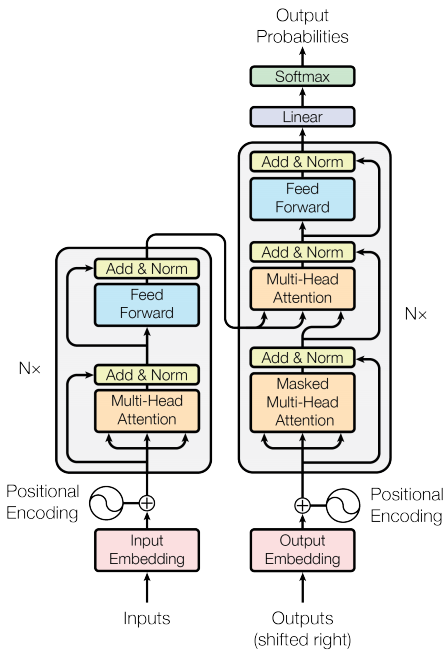

[](../../)

## [](../../main_page/GenAI)



*Fig. 1: A common Encoder decoder architecture in LLMs*


Of course. I'm glad the tutorial has been helpful.

Here is the complete, unabridged, and final version of our deep dive into Encoder-Decoder architectures, with all of our detailed discussions, mathematical formulations, code, and examples consolidated into a single document for your reference.

-----

## A Deep Dive into Encoder-Decoder Transformers (Definitive Edition)

*Last Updated: June 9, 2025*

### 1\. The Task: Sequence-to-Sequence (Seq2Seq) Transformation 📝

Encoder-decoder models are the canonical choice for any task that maps one sequence of arbitrary length to another. They form a powerful and flexible framework for problems where the input and output have different lengths, structures, or even languages.

  * **Classic Examples:** Machine Translation, Summarization, Conversational Response Generation.
  * **The T5 Approach:** The **T5 (Text-to-Text Transfer Transformer)** model unified many NLP tasks under this single, powerful framework by framing every problem as a text-to-text conversion (e.g., prefixing input with `summarize:`).

-----

### 2\. The Encoder-Decoder Architecture 🏛️

This architecture consists of two distinct Transformer stacks connected by a cross-attention mechanism.

  * **The Encoder:** Uses **bidirectional self-attention** to read the entire input sequence and create a rich, contextualized representation, `encoder_outputs`.
  * **The Decoder:** Uses **masked (causal) self-attention** to generate the output sequence autoregressively, token by token. It uses **cross-attention** to consult the `encoder_outputs` at each step.

-----

### 3\. The Lifecycle of an Input: A Concrete Example

To make the data flow tangible, let's trace a single example for an **English-to-German translation** task.

  * **Source Sentence:** `The cat is black.`
  * **Target Sentence:** `Die Katze ist schwarz.`

#### 3.1 Input to the Encoder

The encoder's job is to understand the source sentence. Its input is the tokenized source text, including special tokens.

  * **Encoder Input Sequence:** `[<s>, The, cat, is, black, ., </s>]`

#### 3.2 Output of the Encoder

After processing the input through its bidirectional self-attention layers, the encoder produces a sequence of rich, contextual embeddings—one for each input token. This output is the "memory" of the source sentence.

  * **Encoder Output (`encoder_outputs`):** A sequence of vectors: `[vec_<s>, vec_The, vec_cat, vec_is, vec_black, vec_., vec_</s>]`
  * **Tensor Shape:** `[T_src, hidden_size]` (e.g., `[7, 768]`)

#### 3.3 Inputs and Outputs for the Decoder (During Training)

During training, the decoder uses "teacher forcing." It receives the entire ground-truth target sequence at once to predict all next tokens in parallel. This requires two versions of the target sequence:

1.  **Decoder Input:** The target sequence, shifted right and prepended with a start token. This is what the decoder *sees* to predict the next token.
      * **Example:** `[<s>, Die, Katze, ist, schwarz, .]`
2.  **Decoder Labels (Ground Truth):** The target sequence, shifted left. This is what the decoder *should predict*.
      * **Example:** `[Die, Katze, ist, schwarz, ., </s>]`

The Cross-Entropy Loss will be calculated by comparing the model's prediction at each step against the corresponding token in the label sequence.

-----

### 4\. Key Mathematical and Structural Concepts 🧠

#### 4.1 Positional Encoding in the Encoder and Decoder

Because the self-attention mechanism is permutation-invariant, we must inject information about the order of tokens. In the standard Transformer, this is done via an additive positional encoding ($PE$).

  * **In the Encoder:** The positional encoding is added to the input token embeddings at the bottom of the encoder stack. For an input sequence $X = (x\_1, ..., x\_n)$, the input to the first layer is $X'\_{pos}$:
    $$x'_{pos, i} = x_{token, i} + PE_i$$

  * **In the Decoder:** The exact same process is applied independently to the decoder's inputs. For the target sequence $Y = (y\_1, ..., y\_m)$ being generated, the input to the decoder's self-attention at step `t` is based on the embedding of the previously generated token, $y\_{t-1}$, plus its positional encoding, $PE\_{t-1}$:
    $$y'_{pos, t-1} = y_{token, t-1} + PE_{t-1}$$

#### 4.2 Data Representation and Special Tokens

  * **`<pad>` (Padding Token):** Used to make all sequences in a batch the same length. It is ignored during attention calculations via the **attention mask**.
  * **`<sos>` (Start-of-Sequence) or `<s>`:** The initial input token for the **decoder** during inference, which kicks off the generation process.
  * **`<eos>` (End-of-Sequence) or `</s>`:** Signals the end of a sequence. The model learns to stop generating when it produces this token.

#### 4.3 Causal Masking in the Decoder

  * **Purpose:** To preserve the autoregressive property. When predicting token `t`, the decoder must only see tokens `< t`.
  * **Application:** Causal masking is applied **only within the decoder's self-attention layer**.
  * **Mathematical Formulation:** A mask matrix, $M\_{causal}$, is added to the attention scores before the softmax.
    $$M_{ij} = \begin{cases} 0 & \text{if } i \geq j \\ -\infty & \text{if } i < j \end{cases}$$ $$\text{MaskedSelfAttention}(Q_d, K_d, V_d) = \text{softmax}\left(\frac{Q_d K_d^T}{\sqrt{d_k}} + M_{causal}\right)V_d$$

#### 4.4 The Decoder Block Data Flow: From Self-Attention to Cross-Attention

The Query for self-attention and the Query for cross-attention are **two different vectors**, generated at different stages within the same decoder block. Let's trace a tensor `x` (the output from the previous decoder layer) as it passes through a single decoder block.

```
          Input to Decoder Block (x)
          (Shape: [B, T_tgt, C])
                   │
                   ▼
┌──────────────────────────────────────────────────────────────────────────────┐
│           Sub-layer 1: MASKED SELF-ATTENTION                                 │
│                                                                              │
│   x_norm1 = LayerNorm(x)                                                     │
│   Q_self, K_self, V_self = projections from x_norm1                          │
│   self_attn_output = Attention(Q_self, K_self, V_self, causal_mask=True)     |
│                                                                              │
└──────────────────────────────────────────────────────────────────────────────┘
                   │
                   ▼
    x_residual1 = x + self_attn_output
    (Shape: [B, T_tgt, C])
                   │
                   ▼
┌───────────────────────────────────────────────────────────────────────────────┐
│           Sub-layer 2: CROSS-ATTENTION                                        │
│                                                                               │
│   x_norm2 = LayerNorm(x_residual1)                                            │
│                                                                               │
│   Q_cross = x_norm2 * W_Q_cross <─────────── This is the new Query            |
│                                                                               │
│   K_cross = encoder_output * W_K_cross <───┐                                  |
│   V_cross = encoder_output * W_V_cross <───┴── From Encoder                   |
│                                                                               │      
│   cross_attn_output = Attention(Q_cross, K_cross, V_cross, causal_mask=False) |
│                                                                               │
└───────────────────────────────────────────────────────────────────────────────┘
                   │
                   ▼
    x_residual2 = x_residual1 + cross_attn_output
    (Shape: [B, T_tgt, C])
                   │
                   ▼
┌────────────────────────────────────────────────────────┐
│          Sub-layer 3: FEED-FORWARD NETWORK             │
└────────────────────────────────────────────────────────┘
                   │
                   ▼
    Output of Decoder Block
```

#### 4.5 Cross-Attention: The Mathematical Bridge

Cross-attention allows the decoder to query the full encoded input at each generation step.

  * **Mechanism & Formulation:**
    1.  The **Query (Q)** vectors are generated from the decoder's own state (output of its self-attention sub-layer, $x_{\text{norm2}}$).
     
        $$Q_d = x_{\text{norm2}} W^Q_{cross}$$

    2.  The **Key (K) and Value (V)** vectors are generated from the **final output of the encoder stack**, `encoder_outputs`. These are generated once and reused by every decoder layer.

         $$K_e = \text{encoder\_outputs} \cdot W^K_{cross}$$ $$V_e = \text{encoder\_outputs} \cdot W^V_{cross}$$
      
    4.  The attention is calculated **without a causal mask**:
       
        $$\text{CrossAttention}(Q_d, K_e, V_e) = \text{softmax}\left(\frac{Q_d K_e^T}{\sqrt{d_k}}\right)V_e$$

-----

### 5\. T5 Architecture by the Numbers 🔢

The T5 model was released in several sizes, scaling the same core architecture.

| Model Variant | Total Parameters | Num. Layers (Encoder/Decoder) | Hidden Size ($d\_{model}$) | Feed-Forward Size ($d\_{ff}$) | Num. Heads | Head Size ($d\_{kv}$) |
| :--- | :--- | :--- | :--- | :--- | :--- | :--- |
| **T5-Small** | 60 Million | 6 / 6 | 512 | 2048 | 8 | 64 |
| **T5-Base** | 220 Million | 12 / 12 | 768 | 3072 | 12 | 64 |
| **T5-Large** | 770 Million | 24 / 24 | 1024 | 4096 | 16 | 64 |
| **T5-3B** | 3 Billion | 24 / 24 | 1024 | 16384 | 32 | 128 |
| **T5-11B** | 11 Billion | 24 / 24 | 1024 | 65536 | 128 | 128 |

-----

### 6\. The Final Output Layer and Training ⚙️

  * **Final Output Layer:** A single linear layer at the top of the decoder stack projects the final hidden state to the vocabulary size to produce logits.
  * **Loss Function:** The model is trained to minimize the **Cross-Entropy Loss** between the predicted logits and the true target tokens.
    $$L(\theta) = - \sum_{t=1}^{m} \log P(y_t | y_{<t}, X; \theta)$$
  * **Evaluation Metrics:** For seq2seq tasks, we use metrics like **BLEU** (for translation) and **ROUGE** (for summarization) to compare the generated output against a human-written reference.

-----

### 7\. From-Scratch Implementation of an Encoder-Decoder Model 💻

This section provides a simple, end-to-end implementation using PyTorch to demonstrate the fundamental data flow.

```python
import torch
import torch.nn as nn
from torch.nn import functional as F

# --- Hyperparameters ---
batch_size = 32
block_size = 128
learning_rate = 3e-4
device = 'cuda' if torch.cuda.is_available() else 'cpu'
n_embd = 256
n_head = 4
n_layer = 2
dropout = 0.2
eval_interval = 500
max_steps = 5001

# --- 1. Data Preparation ---
text = "This is a simple demonstration of an encoder-decoder model. The task will be to 'summarize' a short text by learning to replicate its first half."
chars = sorted(list(set(text)))
vocab_size = len(chars)
stoi = { ch:i for i,ch in enumerate(chars) }
itos = { i:ch for i,ch in enumerate(chars) }
encode = lambda s: [stoi.get(c, 0) for c in s]
decode = lambda l: ''.join([itos.get(i, '?') for i in l])
data = torch.tensor(encode(text), dtype=torch.long)
train_data, val_data = data[:int(0.9*len(data))], data[int(0.9*len(data)):]

def get_batch(split):
    data = train_data if split == 'train' else val_data
    ix = torch.randint(len(data) - block_size, (batch_size,))
    src = torch.stack([data[i:i+block_size//2] for i in ix])
    tgt = torch.stack([data[i+block_size//2:i+block_size] for i in ix])
    return src.to(device), tgt.to(device)

# --- 2. Model Components ---
class MultiHeadAttention(nn.Module):
    def __init__(self, n_embd, num_heads, is_causal=False):
        super().__init__()
        self.num_heads, self.head_size = num_heads, n_embd // num_heads
        assert n_embd % num_heads == 0
        self.c_attn = nn.Linear(n_embd, 3 * n_embd)
        self.c_proj = nn.Linear(n_embd, n_embd)
        self.resid_dropout = nn.Dropout(dropout)
        self.is_causal = is_causal
        if self.is_causal:
            self.register_buffer('tril', torch.tril(torch.ones(block_size, block_size)).view(1, 1, block_size, block_size))

    def forward(self, x, context=None):
        B, T, C = x.shape
        is_cross_attention = context is not None
        
        if is_cross_attention:
            q = self.c_attn(x).split(self.n_embd, dim=2)[0]
            k, v = self.c_attn(context).split(self.n_embd, dim=2)[1:]
        else:
            q, k, v = self.c_attn(x).split(self.n_embd, dim=2)

        q = q.view(B, T, self.num_heads, self.head_size).transpose(1, 2)
        T_ctx = context.shape[1] if is_cross_attention else T
        k = k.view(B, T_ctx, self.num_heads, self.head_size).transpose(1, 2)
        v = v.view(B, T_ctx, self.num_heads, self.head_size).transpose(1, 2)

        att = (q @ k.transpose(-2, -1)) * (1.0 / self.head_size**0.5)
        if self.is_causal:
            att = att.masked_fill(self.tril[:,:,:T,:T] == 0, float('-inf'))
        att = F.softmax(att, dim=-1)
        
        y = (att @ v).transpose(1, 2).contiguous().view(B, T, C)
        return self.resid_dropout(self.c_proj(y))

class FeedForward(nn.Module):
    def __init__(self, n_embd):
        super().__init__()
        self.net = nn.Sequential(nn.Linear(n_embd, 4*n_embd), nn.ReLU(), nn.Linear(4*n_embd, n_embd), nn.Dropout(dropout))
    def forward(self, x): return self.net(x)

class EncoderBlock(nn.Module):
    def __init__(self, n_embd, n_head):
        super().__init__()
        self.sa = MultiHeadAttention(n_embd, n_head, is_causal=False)
        self.ffwd = FeedForward(n_embd)
        self.ln1, self.ln2 = nn.LayerNorm(n_embd), nn.LayerNorm(n_embd)
    
    def forward(self, x):
        x = x + self.sa(self.ln1(x))
        x = x + self.ffwd(self.ln2(x))
        return x

class DecoderBlock(nn.Module):
    def __init__(self, n_embd, n_head):
        super().__init__()
        self.sa = MultiHeadAttention(n_embd, n_head, is_causal=True)
        self.cross_attn = MultiHeadAttention(n_embd, n_head, is_causal=False)
        self.ffwd = FeedForward(n_embd)
        self.ln1, self.ln2, self.ln3 = nn.LayerNorm(n_embd), nn.LayerNorm(n_embd), nn.LayerNorm(n_embd)

    def forward(self, x, context):
        x = x + self.sa(self.ln1(x))
        x = x + self.cross_attn(self.ln2(x), context=context)
        x = x + self.ffwd(self.ln3(x))
        return x

# --- 3. Full Encoder-Decoder Model ---
class EncoderDecoderModel(nn.Module):
    def __init__(self):
        super().__init__()
        self.token_embedding_table = nn.Embedding(vocab_size, n_embd)
        self.position_embedding_table = nn.Embedding(block_size, n_embd)
        self.encoder = nn.Sequential(*[EncoderBlock(n_embd, n_head=n_head) for _ in range(n_layer)])
        self.decoder_blocks = nn.ModuleList([DecoderBlock(n_embd, n_head=n_head) for _ in range(n_layer)])
        self.ln_f = nn.LayerNorm(n_embd)
        self.lm_head = nn.Linear(n_embd, vocab_size)

    def forward(self, src, tgt, targets=None):
        B_src, T_src = src.shape
        B_tgt, T_tgt = tgt.shape
        
        src_tok_emb = self.token_embedding_table(src)
        src_pos_emb = self.position_embedding_table(torch.arange(T_src, device=device))
        src_x = src_tok_emb + src_pos_emb
        encoder_output = self.encoder(src_x)

        tgt_tok_emb = self.token_embedding_table(tgt)
        tgt_pos_emb = self.position_embedding_table(torch.arange(T_tgt, device=device))
        decoder_x = tgt_tok_emb + tgt_pos_emb
        
        for block in self.decoder_blocks:
            decoder_x = block(decoder_x, context=encoder_output)

        logits = self.lm_head(self.ln_f(decoder_x))

        loss = None
        if targets is not None:
            loss = F.cross_entropy(logits.view(-1, logits.size(-1)), targets.view(-1))
        return logits, loss

    @torch.no_grad()
    def generate(self, src, max_new_tokens):
        self.eval()
        src = src.to(device)
        tgt = torch.zeros((src.shape[0], 1), dtype=torch.long, device=device)

        src_emb = self.token_embedding_table(src) + self.position_embedding_table(torch.arange(src.shape[1], device=device))
        encoder_output = self.encoder(src_emb)
        
        for _ in range(max_new_tokens):
            tgt_cond = tgt[:, -block_size:]
            tgt_emb = self.token_embedding_table(tgt_cond) + self.position_embedding_table(torch.arange(tgt_cond.shape[1], device=device))
            decoder_x = tgt_emb
            for block in self.decoder_blocks:
                decoder_x = block(decoder_x, context=encoder_output)
            logits = self.lm_head(self.ln_f(decoder_x))
            next_token_logits = logits[:, -1, :]
            probs = F.softmax(next_token_logits, dim=-1)
            next_token = torch.multinomial(probs, num_samples=1)
            tgt = torch.cat((tgt, next_token), dim=1)
        self.train()
        return tgt

# --- 4. Training Loop ---
model = EncoderDecoderModel()
m = model.to(device)
optimizer = torch.optim.AdamW(model.parameters(), lr=learning_rate)

print("Starting training...")
for steps in range(max_steps):
    src, tgt = get_batch('train')
    logits, loss = model(src, tgt, targets=tgt)
    optimizer.zero_grad(set_to_none=True)
    loss.backward()
    optimizer.step()
    if steps % eval_interval == 0:
        print(f"Step {steps}, Training Loss: {loss.item():.4f}")

# --- 5. Inference from the model ---
print("\n--- Generating Text ---")
src, _ = get_batch('val')
src_text_full = decode(src[0].tolist())
src_for_gen = src[:1, :]

generated_tokens = m.generate(src_for_gen, max_new_tokens=src.shape[1])[0].tolist()
generated_text = decode(generated_tokens)

print(f"Source Text:\n'{src_text_full}'")
print(f"\nGenerated Text:\n'{generated_text}'")
```


## Responding to important questions and addressing confusion

### **1. How Positional Encoding is Applied to Cross-Attention**

This is a subtle but critical point. The direct answer is that positional encoding is **not explicitly applied again** during the cross-attention step. Instead, the necessary positional information is already **"baked into"** the vectors that serve as inputs to the cross-attention mechanism.

Let's trace the information:

1.  **Encoder-Side:** The source sequence tokens are combined with their positional embeddings (`x' = x_token + PE_pos`). The encoder processes these position-aware vectors. Therefore, the final `encoder_outputs` are a sequence of vectors where each vector is a rich contextual representation that is implicitly aware of its original position in the source sentence.

2.  **Decoder-Side:** The decoder's Query vector ($Q_d$) is derived from its own state. This state was also built using positional embeddings for the target sequence. So, the Query "knows" its position within the *output* sequence. It asks a question like, "I am at position `t` of the translation; what from the source is relevant now?"

3.  **The Cross-Attention Step:**
    * The **Key ($K_e$) and Value ($V_e$)** vectors are linear projections of the `encoder_outputs`. Since the `encoder_outputs` are already position-aware, the Key and Value vectors inherit this information. They represent the content *and* original position of the source tokens.
    * The **Query ($Q_d$)** from the decoder attends to these Keys.

The model learns, through training, to interpret the relationships between the position-aware decoder Queries and the position-aware encoder Keys. The positional information isn't added again; it's already an intrinsic property of the vectors being used. The model learns to map "the query from decoder position 5" to "the keys from encoder positions 2, 3, and 4" if that is the pattern required by the task (e.g., translation).

---

### **2. Decoder Input During Inference Time**

We do not pad the decoder's input during inference. The process is **autoregressive**, meaning we build the sequence one token at a time.

Let's walk through the first few steps of generating a translation:

* **Step t=1:**
    * The *only* input to the decoder is a single "start-of-sequence" token (`<s>`).
    * The decoder's input tensor therefore, has a sequence length of 1. Shape: `[batch_size, 1]`.
    * The decoder performs a trivial self-attention on this single token, then cross-attends to the full `encoder_output`, and finally produces logits for the *first* real output token.

* **Step t=2:**
    * We take the token predicted at Step 1 (e.g., "Die") and append it to our running sequence.
    * The new input to the decoder is now the sequence `[<s>, Die]`.
    * The decoder's input tensor now has a sequence length of 2. Shape: `[batch_size, 2]`.
    * The process repeats: masked self-attention is performed on `[<s>, Die]`, followed by cross-attention, to produce logits for the *second* real output token.

* **Step t=3 and beyond:**
    * The process continues, with the decoder's input sequence growing by one token at each step.

**Conclusion:** Padding is a technique used during training to handle batches of *known but differing* lengths. During inference, the decoder's input sequence is built dynamically, so there is no "rest of the tokens" to pad.

---

### **3. How Padding is Ignored by the Attention Mask**

This is an excellent question that reveals a common point of confusion. The attention mask does **not** change the *size* of the attention matrix. It changes the *values within the matrix* before the softmax step, effectively nullifying the influence of padded tokens.

Let's break down the mechanism precisely.

1.  **The `[PAD]` Token Embedding:** You are correct that the padding token does have its own embedding vector. However, this is largely irrelevant because the attention mask prevents this embedding from contributing to the context of other tokens.

2.  **The Attention Score Calculation:** After the scaled dot product, we have an attention score matrix of shape `[batch_size, num_heads, sequence_length, sequence_length]`. Let's call it `scores`. This matrix contains scores indicating the relevance of every token to every other token.

3.  **Applying the Mask (The Critical Step):**
    * We have an `attention_mask` tensor, typically of shape `[batch_size, sequence_length]`, with `1`s for real tokens and `0`s for `[PAD]` tokens.
    * This mask is broadcast to match the shape of the `scores` matrix.
    * We use the mask to replace the attention scores of the padding tokens with a very large negative number (e.g., -10,000 or `-inf`).
    * In PyTorch, this looks like: `scores.masked_fill_(attention_mask == 0, -1e9)`

4.  **The Effect of Softmax:**
    * The softmax function is applied along the last dimension of the score matrix: `softmax(scores)`.
    * The softmax function involves exponentiation ($e^x$). When applied to the scores:
        * A normal score, say `3.4`, becomes $e^{3.4}$.
        * A masked score, `-1e9`, becomes $e^{-1000000000}$, which is a number so infinitesimally close to **zero** that for all practical purposes, it is zero.

5.  **The Final Result:** After the softmax, the attention weights for all `[PAD]` tokens are effectively zero. When we perform the final step of multiplying the attention weights with the Value vectors, the Value vectors of the padding tokens are multiplied by zero. This means they contribute absolutely nothing to the final contextual representation of the real tokens.

In summary, the model ignores padding not by learning that the padding embedding is unimportant, but through a direct, mathematical knockout blow delivered by the attention mask **before** the softmax calculation.
