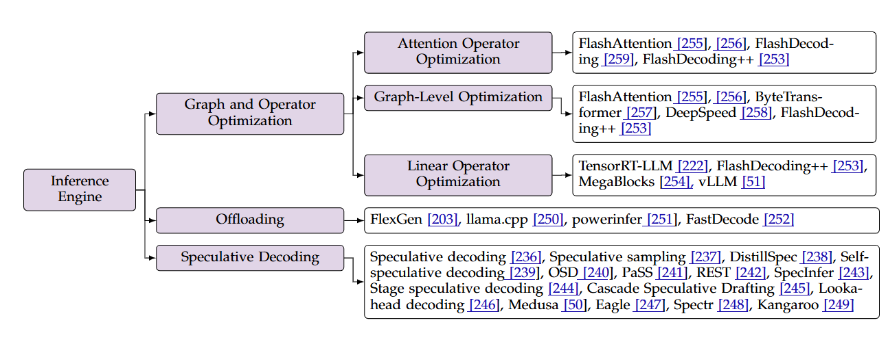

## 

# Efficient Inference Engine

## 
FlashAttention is a pivotal innovation that addresses one of the most fundamental bottlenecks in the Transformer architecture. Unlike architectural changes like MoE or GQA, FlashAttention is a groundbreaking implementation that doesn't change the mathematics of attention but radically alters how it's computed on the hardware.

