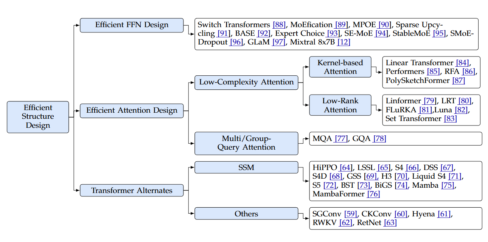

## 

# Efficient Structure Designs for LLMs.

*Fig.1 Efficient Structure Design for LLMS*

# Efficient FFN
## 

While innovations like MoE and SwiGLU focus on redesigning the FFN block within a single Transformer layer, Cross-Layer Parameter Sharing tackles efficiency from a different angle: it re-evaluates the relationship between the layers themselves. It asks a simple but profound question: "Does every layer in a deep network truly need its own unique set of weights?"

## 

While attention mechanisms get much of the spotlight, the Feed-Forward Network (FFN) is the computational workhorse of the Transformer. Typically comprising two-thirds of a model's parameters, the FFN block is a critical target for efficiency innovations. As of mid-2025, the strategies have evolved far beyond simply tweaking dimensions.

## 

While Mixture of Experts (MoE) offers a path to scale models to enormous parameter counts via sparsity, another critical innovation has optimized the performance of the core "dense" Transformer block itself. This is the <b>Gated Linear Unit (GLU)</b>, and specifically its most successful variant, <b>SwiGLU</b>.

As of mid-2025, SwiGLU has replaced the traditional FFN in most state-of-the-art dense language models (like Meta's Llama series, Google's PaLM, and Mistral's dense models). This tutorial explores the intuition, mathematics, and implementation behind this powerful and efficient architecture.

# Low Complexity Attention
## Low Rank Attention

## 

Overview of Linformer, why we need it, and side-by-side pseudo-code comparing traditional self-attention to Linformer self-attention. We’ll keep the example to single-head attention for clarity, but in practice you would typically use multi-head attention (with separate projections for each head).

## Kernel Based Attention
## 

Performers are Transformer architectures which can estimate regular (softmax) full-rank-attention Transformers with provable accuracy, but using only linear (as opposed to quadratic) space and time complexity, without relying on any priors such as sparsity or low-rankness. To approximate softmax attentionkernels, Performers use a novel Fast Attention Via positive Orthogonal Random features approach (FAVOR+), which may be of independent interest for scalable kernel methods. FAVOR+ can also be used to efficiently model kernelizable attention mechanisms beyond softmax. This representational power is crucial to accurately compare softmax with other kernels for the first time on large-scale tasks, beyond the reach of regular Transformers, and investigate optimal attention-kernels. Performers are linear architectures fully compatible with regular Transformers and with strong theoretical guarantees: unbiased or nearly-unbiased estimation of the attention matrix, uniform convergence and low estimation variance. We tested Performers on a rich set of tasks stretching from pixel-prediction through text models to protein sequence modeling. Performer demonstrates competitive results with other examined efficient sparse and dense attention methods, showcasing effectiveness of the novel attention-learning paradigm leveraged by Performers.

# Multi Query Attention & Grouped Query Attention
## 

The Transformer architecture's self-attention mechanism is the engine of modern AI. However, as models and their context windows grow, the computational and memory costs of standard Multi-Head Attention (MHA) become a significant bottleneck, especially during inference.

This tutorial provides an in-depth exploration of two powerful solutions: Multi-Query Attention <b>(MQA)</b> and Grouped-Query Attention <b>(GQA)</b>. Understanding these architectural details, including their mathematical foundations and impact on memory, is essential for grasping how models like Google's Gemini, Meta's Llama 3, and Mistral AI's models operate so efficiently.

