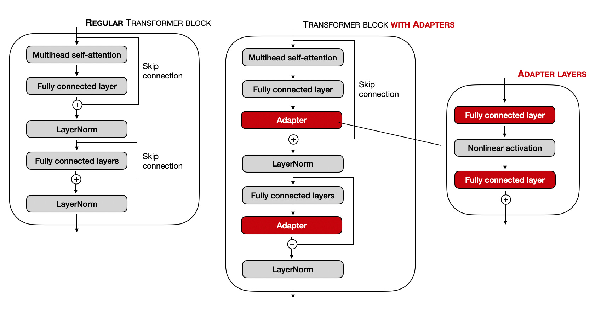

[](../../../)

## [](../../../main_page/GenAI)
## [](../FineTuning)


### Full Tutorial: Adapter-based Fine-Tuning

As Large Language Models (LLMs) grew to billions of parameters, **Full Fine-Tuning**—updating every single weight for each new task—became prohibitively expensive. It required massive computational resources and resulted in a new, full-sized model copy for every task.

**Adapter Tuning** was proposed as a solution. The core idea is simple yet profound: what if we could freeze the massive pre-trained LLM, which already contains vast general knowledge, and only train a handful of tiny, new parameters for each specific task?

#### **Example & Intuition**

Imagine a brilliant, experienced doctor (the pre-trained LLM) who knows everything about general medicine. Now, you want them to specialize in a niche area, like pediatric dermatology in San Jose, CA.

  * **Full Fine-Tuning:** You would force the doctor to go through a whole new residency, re-learning everything. It's effective but incredibly wasteful.
  * **Adapter Tuning:** You give the doctor a small, specialized booklet (the **Adapter**) on local pediatric dermatology. The doctor's core knowledge remains untouched, but they can consult this booklet to handle specific cases. For another specialty, you just give them a different booklet.

This is the intuition behind adapters: they are small, plug-in modules that adapt the LLM's behavior without altering its core knowledge.

#### **Use Case Scenario**

The goal is to efficiently adapt a single, large pre-trained model to multiple downstream tasks without creating separate model copies.

  * **A Customer Service Hub:** A company uses a single, powerful base LLM. They train separate, lightweight adapters for different departments:
      * An **"Order Inquiry" adapter** is trained on data related to tracking shipments and order status.
      * A **"Technical Support" adapter** is trained on product manuals and troubleshooting guides.
      * A **"Billing" adapter** is trained on invoicing and payment questions.
  * When a user query comes in, the system routes it to the base LLM and dynamically loads the appropriate adapter (e.g., the "Billing" adapter for a payment question). This provides specialized performance with massive storage and computational savings.

-----


*Fig.~1 Adaptor finetunning. Adaptor modules are placed before the skip connection node.*

### How It Works: A Detailed Breakdown

#### 1\. The Architecture: Injecting Adapter Modules

The key innovation of Adapter Tuning is injecting small, new modules *inside* each layer of the pre-trained Transformer. The original Transformer weights are **frozen** and not trained.

A standard Transformer block contains two main sub-layers: a Multi-Head Attention block and a Feed-Forward Network (FFN). Adapter modules are typically inserted **after** each of these sub-layers.

  * **The Adapter Module Structure:** An adapter itself is a small neural network with a "bottleneck" architecture. This design is critical for ensuring it has very few parameters.
    1.  **Down-Projection:** A linear layer that projects the high-dimensional input from the Transformer layer (e.g., dimension `d_model` = 768) down to a much smaller dimension (e.g., `d_adapter` = 64).
    2.  **Non-Linearity:** An activation function (like GELU or ReLU) is applied.
    3.  **Up-Projection:** A linear layer that projects the small dimension back up to the original dimension (`d_model` = 768).
  * **Residual Connection:** The output of the adapter module is added back to the original input via a residual (or skip) connection. This is vital for training stability.

#### 2\. Weight Initialization: The Key to Stability

This is a critical and non-obvious part of making adapters work. If you initialize the adapter weights randomly, their initial output will be large and random "noise" that gets added to the carefully tuned output of the base LLM, completely disrupting its performance and making the training process unstable from the very first step.

To solve this, adapters are initialized to be **near-identity functions**. This means at the beginning of training, they have almost no effect on the LLM's output.

  * **Down-Projection Weights (`W_down`):** These are typically initialized with a standard method, such as a **Kaiming or Xavier initialization**, or simply drawn from a normal distribution with a small standard deviation (e.g., 0.02). This starts the weights as small random values.
  * **Up-Projection Weights (`W_up`):** This is the crucial step. These weights are initialized to be **near-zero**.
  * **The Result:** Because the `W_up` weights are near-zero, the entire output of the adapter module (`h_up`) is also near-zero at the beginning. When this near-zero vector is added back to the original hidden state `h` via the residual connection (`h + h_up`), the output is almost identical to `h`. This ensures that at the start of fine-tuning, the adapter is "silent" and does not disrupt the powerful, pre-trained knowledge of the base model. As training begins, the weights `W_down` and `W_up` are gradually updated to non-zero values, allowing the adapter to "learn" its task-specific function without causing instability.

#### 3\. The Mathematics

Let `h` be the `d`-dimensional output vector from a Transformer sub-layer (e.g., the Attention block). The adapter module transforms `h` as follows:

1.  **Down-Projection:** Project `h` into the bottleneck.

      * $h\_{down} = hW\_{down}$
      * `W_down` is the weight matrix of size `d x r`, where `r` is the small adapter dimension (the bottleneck size).

2.  **Non-Linear Activation:**

      * $h\_{act} = f(h\_{down})$
      * `f` is the non-linear function (e.g., GELU).

3.  **Up-Projection:** Project back to the original dimension.

      * $h\_{up} = h\_{act}W\_{up}$
      * `W_up` is the weight matrix of size `r x d`.

4.  **Final Output with Residual Connection:**

      * $h\_{out} = h + h\_{up}$

During training, only the weights `W_down` and `W_up` (and their associated biases) are updated.

#### 4\. The Training Process

  * **Input-Output Training Pairs:** The data is exactly the same as it would be for full fine-tuning. For a text classification task, it would be `(text, label)` pairs. For instruction fine-tuning, it would be `(instruction, response)` pairs.
  * **The Forward Pass:** The input data flows through the Transformer as usual. However, at each designated point, the hidden state `h` is also passed through the adapter module, and the adapter's output is added back.
  * **The Loss Function:** The loss function is also identical to what would be used in full fine-tuning. For a classification task, it's typically **Cross-Entropy Loss**. For a generative task (like SFT), it's **Masked Cross-Entropy Loss** on the response tokens. The loss is calculated based on the final output of the model.
  * **Backpropagation (The Key Difference):** When the gradients are computed via backpropagation, they are only allowed to flow back to and update the parameters of the **adapter modules** and any new output layers (like a classification head). The gradients for the original LLM weights are effectively zeroed out, leaving the multi-billion parameter model frozen.

#### 5\. Inference

During inference, the process is straightforward:

1.  Load the frozen, pre-trained base LLM.
2.  Load the small, task-specific adapter weights.
3.  Inject the adapter modules into the layers of the base model.
4.  Perform a standard forward pass on your input data to get the prediction.

The only overhead compared to using the base model is the very small computational cost of the extra adapter layers.

-----

### Conceptual Training Loop (Without Libraries)

Here is a simplified, conceptual Python-like code to illustrate the core logic of a training loop.

```python
# --- 1. Model & Data Setup ---
# Load a pre-trained transformer model (e.g., from scratch or a library)
base_model = PretrainedTransformer() 
# Load your task-specific dataset (e.g., text and labels)
dataset = load_my_task_dataset()

# Freeze all parameters in the base model
for param in base_model.parameters():
    param.requires_grad = False

# Inject trainable adapter modules into each layer of the base model
# This conceptual function also handles the specific weight initialization
add_and_initialize_adapters_to_model(base_model, bottleneck_dim=64) 
# Add a new classification head for the task
classification_head = LinearLayer(input_dim=base_model.hidden_dim, output_dim=num_classes)

# Define the optimizer. Crucially, it only gets the parameters of the new, trainable layers.
# The `get_adapter_and_head_params` function would collect all W_down, W_up, and head weights.
trainable_params = get_adapter_and_head_params(base_model, classification_head)
optimizer = AdamOptimizer(params=trainable_params, lr=1e-4)
loss_function = CrossEntropyLoss()

# --- 2. The Training Loop ---
for epoch in range(num_epochs):
    for batch in dataset:
        # Zero out gradients from the previous step
        optimizer.zero_grad()

        # Get inputs and labels from the batch
        input_text = batch['text']
        true_labels = batch['label']

        # --- Forward Pass ---
        # Get the final hidden state from the base model (with adapters active)
        # The model's forward pass is modified to include the adapter logic
        last_hidden_state = base_model(input_text)
        # Use the [CLS] token's state for classification
        cls_embedding = last_hidden_state[:, 0, :]
        # Get the final scores (logits) from the classification head
        logits = classification_head(cls_embedding)

        # --- Loss Calculation ---
        # Calculate the loss between the model's predictions and the true labels
        loss = loss_function(logits, true_labels)

        # --- Backward Pass ---
        # Compute gradients. This will ONLY compute them for the trainable parameters
        # that were passed to the optimizer (the adapters and the head).
        loss.backward()

        # --- Weight Update ---
        # Update the weights of the adapters and the head
        optimizer.step()

    print(f"Epoch {epoch+1}, Loss: {loss.item()}")
```

-----

### References

  * **Original Adapter Paper:** Houlsby, N., et al. (2019). "Parameter-Efficient Transfer Learning for NLP." *Proceedings of the 36th International Conference on Machine Learning.* This is the paper that introduced the "bottleneck adapter" architecture and the near-identity initialization strategy.
  * **AdapterHub:** Pfeiffer, J., et al. (2020). "AdapterHub: A Framework for Adapting Transformers." *Proceedings of the 2020 Conference on Empirical Methods in Natural Language Processing: System Demonstrations.* AdapterHub is a framework and repository for sharing and using pre-trained adapters.
