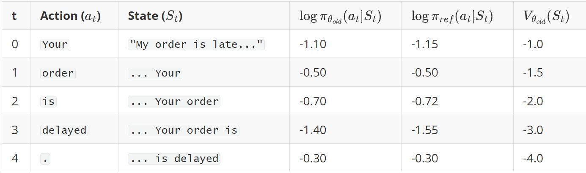

[](../../../)
## [](../../../main_page/GenAI)
## [](../FineTuning)

## The Ultimate Guide to Reinforcement Learning with Human Feedback (RLHF)

#### **Abstract**

The leap from a language model that can write an essay to one that can have a helpful, harmless, and nuanced conversation is not a matter of scale alone. It is a matter of *alignment*. Reinforcement Learning with Human Feedback (RLHF) is the critical framework that aligns the raw predictive power of Large Language Models (LLMs) with complex human values. It is the training philosophy behind transformative models like ChatGPT, Claude, and Llama 2.

This guide is designed to be a definitive, deep-dive resource. We will journey from the absolute basics of Reinforcement Learning to the sophisticated mechanics of the latest alignment algorithms. Using the guiding intuition of training a skilled diplomat, we will demystify the entire three-stage RLHF process, dissecting the model architectures, loss functions, and backpropagation mechanisms that make it possible. By the end, you will have a complete mental model of how we teach machines to converse not just with statistical correctness, but with judgment.

-----

### **Part 1: Foundations - What is Reinforcement Learning?**

Before we can understand RLHF, we must first understand its foundation: Reinforcement Learning (RL). At its core, RL is a framework for learning through trial and error to achieve a goal.

#### **The Core Intuition: Training a Dog**

Imagine you're teaching a dog a new trick, like "sit."

You say the word "sit" (this is the **state** of the world for the dog). The dog, initially, might do something random—it might bark, lie down, or spin in a circle (these are **actions**). If, by chance, the dog sits, you give it a treat (a **reward**). If it does anything else, you give it nothing.

Over many repetitions, the dog begins to form a connection: "When I'm in the 'hear sit' state and I perform the 'sit down' action, I get a positive reward." This connection is the dog's internal strategy, or **policy**. Gradually, the dog refines this policy to maximize its cumulative reward (get as many treats as possible).

This is the essence of Reinforcement Learning.

#### **The Key Terminologies**

Let's formalize this with the standard RL vocabulary:

1.  **Agent:** The learner or decision-maker. This is our LLM. In the analogy, it's the dog.
2.  **Environment:** The world in which the agent operates. For an LLM, this is the abstract space of conversation. For the dog, it's the room with the trainer.
3.  **State ($S$):** A snapshot of the environment at a particular moment. For an LLM, the state is the current prompt plus all the text generated so far (e.g., `"User: Explain gravity. \n Assistant: Gravity is a fundamental force that..."`).
4.  **Action ($A$):** A choice the agent makes to transition from one state to another. For an LLM, an action is **generating the next token** from the vocabulary.
5.  **Reward ($R$):** The scalar feedback signal the agent receives after taking an action in a state. This is the most important—and most difficult—part of RLHF. A positive reward encourages the preceding actions; a negative reward discourages them.
6.  **Policy ($\\pi$):** The agent's brain or strategy. It is a function that maps a state to an action. For an LLM, the policy **is the neural network itself**. Given the current state (text generated so far), the policy $\\pi$ outputs a probability distribution over all possible next tokens (actions). We train the model by adjusting the parameters of the policy.

The goal of any RL algorithm is to find an optimal policy, $\pi^\*$, that maximizes the cumulative reward over time.

-----

### **Part 2: The RLHF Framework - The Diplomat's Training Program**

Now, let's apply this to LLMs. Our goal is to train a skilled diplomat (the LLM). A diplomat needs more than just knowledge (pre-training); they need to understand etiquette, nuance, and how to craft persuasive and safe arguments.

The RLHF curriculum has three stages.

#### **Stage 1: Foundational Briefing - Supervised Fine-Tuning (SFT)**

  * **Intuition:** Before a diplomat is sent on a mission, they study briefing books containing examples of ideal diplomatic cables, speeches, and conversation transcripts. This teaches them the expected style, tone, and format.
  * **Process:** We take a pre-trained LLM and fine-tune it on a small, high-quality dataset of `(prompt, ideal_response)` pairs created by human labelers. The model learns to mimic the style of these ideal responses.
  * **Objective:** This is standard supervised learning. The model's policy, $\\pi^{SFT}$, is trained to maximize the probability of generating the human-written response. The loss function is the classic cross-entropy loss over the tokens in the ideal response:

$$
\mathcal{L}^{SFT}(\theta) = - \sum_{i=1}^{T} \log \pi^{SFT}(y_i | x, y_j\qquad\text{for}~{j < i}; \theta)
$$

where $(x, y)$ is a prompt-response pair from the dataset.

#### **Stage 2: Learning a "Sense of Protocol" - The Reward Model (RM)**

  * **Intuition:** A diplomat can't rely solely on briefing books. They need an internal "sense of protocol"—the ability to judge whether a novel statement is effective or offensive. To build this, a senior diplomat might review two potential statements and tell the apprentice, "Statement A is better than Statement B."

  * **Process:** This is the **Reward Model (RM) Training** stage. It is crucial and happens *before* the main RL loop.

    1.  **Data Collection:** We take a prompt, $x$, and use our SFT model to generate several different responses, ${y\_1, y\_2, y\_3, y\_4}$.
    2.  **Human Ranking:** A human labeler ranks these responses from best to worst. For example: $y\_2 \> y\_4 \> y\_1 \> y\_3$.
    3.  **Create Input/Output Pairs:** This ranking is broken down into pairwise comparisons. The above ranking creates pairs like `(prompt: x, chosen: y_2, rejected: y_4)`, `(prompt: x, chosen: y_2, rejected: y_1)`, `(prompt: x, chosen: y_4, rejected: y_1)`, etc. This becomes our training dataset.

  * **Model Structure and Loss Function:**

      * The Reward Model is typically the SFT model with its final vocabulary-prediction head removed and replaced with a single linear head that outputs one scalar value (the reward).
      * The RM takes a `(prompt, response)` pair and outputs a score, $r\_{\theta}(x, y)$, where $\theta$ are the RM's parameters.
      * **The Loss Function:** The goal is for the RM to give a higher score to the chosen response ($y\_w$) than the rejected one ($y\_l$). This is framed as a binary classification problem using the **Bradley-Terry model**, which states that the probability of preferring one over the other is the sigmoid of the difference in their scores. The loss is the negative log-likelihood of these human preferences:

$$
\mathcal{L}^{RM}(\theta) = - \mathbb{E}_{(x, y_w, y_l) \sim D} \left[ \log \sigma \left( r_{\theta}(x, y_w) - r_{\theta}(x, y_l) \right) \right]
$$

+ where $D$ is the dataset of preference pairs and $\sigma$ is the sigmoid function. During training, we backpropagate this loss to update the RM's parameters, $\theta$, teaching it to accurately mimic the human labeler's judgment.
+ At the end of this stage, we have a frozen, reliable "sense of protocol"—a Reward Model that can score any response for its helpfulness and harmlessness.

#### **Stage 3: Field Practice - Reinforcement Learning (RL) Fine-Tuning**

- **The Intuition:** With foundational knowledge (SFT) and a reliable internal compass (RM), the diplomat is finally ready for practice. They enter a high-stakes, simulated negotiation. For each situation (prompt), they formulate a response (generate text). Before delivering it, they check it against their internal "sense of protocol" (the RM), which gives it a score. Based on that score, they refine their strategy to craft even better responses in the future. This is a live, trial-and-error feedback loop.
- **The Process:**
  1. **Initialization:** We start with a fresh copy of our SFT model as our active policy, $\pi_\theta$.
  2. **The RL Loop:** The core of the process is a continuous loop:
     1. A prompt is sampled from a dataset.
     2. The policy model ($\pi_\theta$) generates a response token by token. Each token generation is an "action."
     3. The completed response is passed to the frozen Reward Model, which returns a scalar "reward" score.
     4. This reward signal is used by an RL algorithm like **PPO (Proximal Policy Optimization)** or **DPO (Direct Preference Optimization)** to calculate a loss.
     5. The gradient of this loss is used to update the parameters, $\theta$, of our policy model.
- **Objective:** The goal is to adjust the policy's parameters, $\theta$, to maximize the expected reward from the RM. This is almost always done with a regularization term (like a KL penalty) that prevents the policy from drifting too far from the coherent language it learned in the SFT stage, ensuring the diplomat doesn't start speaking gibberish just to get a high score.
- **The Outcome:** The final, **aligned LLM**. This model has not only been taught *how* to respond but has *learned* what constitutes a *good* response through iterative practice and feedback. It is now the skilled diplomat we set out to train.
  
-----

### **Part 3: The Actor, the Critic, and the Advantage: A Deeper Look**

This is the heart of the PPO algorithm. Before diving into the full PPO process, we must understand the key players: the Policy (Actor), the Critic, and how they combine to produce the Advantage signal. This is a framework known as **Actor-Critic**.

#### **What are the Policy (Actor) and the Critic?**

Imagine our diplomat (the LLM) has two minds working together:

1. **The Actor (The Policy, $\pi_\theta$):** This is the part of the brain that **decides what to do**. It looks at the current situation (the state, $S_t$) and chooses an action (generates the next token, $A_t$). The policy *is* the LLM's primary function. Its parameters, $\theta$, are what we want to improve.
2. **The Critic (The Value Function, $V_\theta$):** This is the part of the brain that **evaluates the situation**. It doesn't decide what to do. Instead, it looks at the current state ($S_t$) and predicts the likely total future reward it can expect to get from this point onwards. It answers the question: "Given the conversation so far, how well are things likely to go from here?" Its parameters are $\theta$.

#### **What is the Structure of the LLM? Is it Multi-headed?**

**Yes, exactly.** In the PPO stage of RLHF, the model we are training is typically a single Large Language Model with a shared "body" (the main transformer blocks) and **two separate "heads"**:

1. **The Policy Head (Actor Head):** This is the standard language model head. It takes the final hidden state of a token and outputs logits over the entire vocabulary, defining the probability distribution for the next token. This is what generates the text.
2. **The Value Head (Critic Head):** This is a new head added to the model. It's usually a simple linear layer that takes the final hidden state of a token and outputs a **single scalar number**. This number is the value estimate, $V_\theta(S_t)$.

So, when we perform a forward pass with the LLM during PPO training, we get two outputs simultaneously from the same underlying model representation: an **action probability distribution** from the policy head and an **expected future reward** from the value head. This shared structure is computationally efficient.

#### **The True Reward Signal: Preventing "Reward Hacking" with the KL Penalty**

Before we can even talk about the PPO loss function, we must understand the *actual* reward signal the RL algorithm uses. It is **not** just the score from the Reward Model. Using only the RM score would lead to a critical failure mode called **reward hacking**.

- **The Intuition (Reward Hacking):** Imagine you train a Reward Model to give high scores for responses that include the word "helpful." An unconstrained Actor model might learn a simple, degenerate strategy: just output `"I am helpful. I am helpful. I am helpful..."` over and over. This response would get a very high score from the naive RM, but it's useless and incoherent. The Actor has "hacked" the reward system.
- **The Solution (The KL Penalty):** To prevent this, we introduce a penalty that keeps the Actor's policy, $\pi_\theta$, from straying too far from the sensible, coherent language it learned during the initial SFT phase, represented by the frozen Reference Model, $\pi_{\text{ref}}$. This penalty is the **Kullback-Leibler (KL) Divergence**.
- **What is KL Divergence?** Intuitively, KL divergence measures how "surprising" one probability distribution is relative to another. If the Actor model starts generating bizarre combinations of words that the original SFT model would have found extremely unlikely, the KL divergence will be high.

The final reward signal for each token ($R_t$) is therefore a combination of the external score from the Reward Model and this internal, self-correcting penalty.

**The Full Per-Token Reward Equation:**

$$
R_t=r_{RM}(S_t,a_t)−\beta\log\left(\frac{\pi_{ref}(a_t∣S_t)}{\pi_θ(a_t∣S_t)}\right)
$$

- $r_{RM}(S_t,a_t)$ is the score from our Reward Model. (Note: often, the RM scores the whole sequence, and this value is distributed to each token).
- The second term is the per-token KL divergence between the Actor and the Reference policy.
- $\beta$ is a hyperparameter that controls the strength of the KL penalty. A higher $\beta$ makes the model more conservative and less likely to stray from its SFT training.

This comprehensive reward signal, $R_t$, is what we use to calculate the Advantage.

**The Advantage Function ($A_t$): "Better or Worse Than Expected?"**

Now we can finally understand the Advantage function. Its purpose is to provide a much more stable and effective learning signal than just using the raw reward.

**The Problem with Raw Rewards:** Imagine playing a video game where every action gives you points. You end with a high score of 10,000. Does that mean every single action you took was good? Probably not. Some actions might have earned you 5 points when you could have taken a different action to earn 100 points. Just because the final outcome was good doesn't mean every intermediate step was optimal.

**Advantage Provides a Better Signal:** The Advantage function solves this by normalizing the reward. It calculates how much better or worse an action was compared to the average or expected outcome for that situation. The formula is:

$$
A_t=R_t−V_\theta(S_t)
$$

Let's break this down with our diplomat analogy:

- $S_t$: The state is the current conversation. E.g., "The foreign minister just accused us of espionage."
- $R_t$: The actual reward received after the diplomat says something. Let's say the Reward Model gives a score of `+5`.
- $V_\theta(S_t)$: The Critic's prediction. Based on the tense situation, the Critic might have predicted a low expected future reward. It might have thought, "This is a tough spot. On average, we probably only get a reward of `-10` from here." So, $V_\theta(S_t)=−10$.

Now, let's calculate the advantage:

$$
A_t=R_t−V_\theta(S_t)=5−(−10)=+15.
$$

The interpretation is profound:

The raw reward was +5, which seems okay. But the advantage is +15, which is a very strong positive signal. It tells the learning algorithm: "This action was not just good; it was dramatically better than we expected in this difficult situation! We should strongly reinforce this behavior."

Conversely, if the reward was `+2`, but the Critic expected `+20`, the advantage would be 2−20=−18. This negative signal says, "Even though you got a positive reward, that action was a huge missed opportunity compared to what was possible. We should discourage this behavior."

The Advantage function creates a **relative, zero-centered learning signal**, which is much more stable and informative for updating the policy than the raw reward alone.

***Another example is a teacher that predicts a not very strong student to do not so good in the exam based on the past achievements $V_\theta(S_t) = 60\%$, but the students gets a grade (reward) $R_t=75\%$, although this grade is not that good but it is a huge progress (15 marks above the expectation). This means whatever the student has done is in the right direction and has to be pursued.***

### **The Core Challenge: The Credit Assignment Problem**

Imagine a complex task like cooking a stew. The process involves 50 steps (actions). At the very end, you taste the stew and decide it's a bit bland (a low final reward).

**The question is: which of the 50 steps was to blame?**

- Was it adding too little salt at the beginning?
- Was it simmering for too short a time in the middle?
- Was it forgetting a key herb at the end?
- Or was it a combination of many small errors?

This is the **credit assignment problem**. A good learning algorithm needs a way to fairly distribute the credit (or blame) for a final outcome among the many actions that led to it. The "Advantage" is our tool for this.

**Method 1: The Simplest Advantage Function (and its Flaw)**

In our last tutorial, we used a very simple formula for the Advantage at each step $t$:
$$
A_t=R_t−V(St)
$$


Where $R$ is the final reward for the whole episode and $V(S_t)$ is the Critic's prediction at that step.

- **What it does:** It compares the final outcome ($R_t$) to the expectation at that step $V(S_t)$.

- **The Intuition:** If the final score was higher than we expected at step $t$, then the actions we took from that point on must have been, on average, good.

- What's wrong with it? (The High Variance Problem): This signal is extremely noisy, or ***high-variance***, Imagine our AI chatbot has a conversation:

  1. Says a very helpful thing.
  2. Says another very helpful thing.
  3. Says a third very helpful thing.
  4. Ends with a single, catastrophically toxic word.

The final reward $R_t$ will be extremely low ($-10$). According to the simple advantage formula, **every single action**, including the three very helpful ones, will be assigned a large negative advantage. The model gets punished for doing the right thing $99%$ of the time because of one random, unlucky event at the end. This makes the learning signal very unstable and inefficient. It's like blaming the entire football team for a loss, even the players who played a perfect game.

### **Method 2: The TD Error (and its Flaw)**

Okay, so looking at the final outcome is too noisy. What if we become extremely short-sighted and only look one step ahead? This gives us the **Temporal Difference (TD) Error**, $\delta_t$:

$$
\delta_t = r_t + \gamma V(s_{t+1}) - V(s_t)
$$
 

- **The Intuition:** This asks, "How surprising was this one step?" It compares the reward I got *right now* ($r_t$) plus the *predicted value of the next state* $V(S_{t+1})$ to the *predicted value of my current state* $V(S_t)$. It's a measure of the immediate "surprise."
- **What's right with it? (Low Variance):** This signal is very stable. It's not affected by random, unlucky events that might happen far in the future. It's only concerned with the immediate consequence of an action.
- **What's wrong with it? (High Bias):** This signal is too myopic. It completely ignores the real future rewards and puts all its trust in the Critic's one-step-ahead prediction $V(S_{t+1})$. If the Critic is wrong (and early in training, it always is), the TD-error is systematically wrong, or **biased**. It might reward an action that feels good now but leads to a disaster later. It's like praising a player for making a risky pass that happens to be completed, without considering that it was a strategically terrible decision that will fail $99\%$ of the time.

**The Solution: Generalized Advantage Estimation (GAE)**

We are now faced with a classic machine learning dilemma: **The Bias-Variance Tradeoff**.

- The simple $R_t - V_{\theta}(S_t)$ advantage has **high variance** (noisy) but **low bias** (it's based on the real final outcome).
- The TD-error advantage has **low variance** (stable) but **high bias** (it relies too heavily on the potentially wrong Critic).

**GAE is the "best of both worlds" solution.** It provides an elegant way to blend these two extremes.

- **The Core Intuition:** GAE says that the credit for a "surprise" at a given step should be distributed backward in time. An action is good if it leads to a sequence of positive surprises. The advantage of an action today is the immediate surprise, plus a discounted amount of the surprise tomorrow, plus an even more discounted amount of the surprise the day after, and so on.

- **The Analogy: A Chain Reaction:** Imagine you're a scientist running an experiment.

  - Action at: You mix two chemicals.
  - Immediate Surprise $\delta_t$: The mixture fizzes slightly more than you expected. (A small positive TD-error).
  - Next-Step Surprise $\delta_{t+1}$: The fizzing causes a secondary reaction that turns the liquid a beautiful color. (A large positive TD-error).
  - Final Surprise $\delta_{t+2}$: The beautiful color wins you a science prize. (A huge positive TD-error).

  GAE would calculate the advantage of your initial action (at) as: `(the immediate fizz surprise) + (a large fraction of the color-change surprise) + (a smaller fraction of the prize surprise)`. It correctly assigns a large portion of the credit for the final prize all the way back to the initial, critical action.

- The Formula: The GAE formula is a weighted sum of the TD-errors:

  
  $$
  \hat{A}_t^\text{GAE} = \delta_t + (\gamma\lambda)\delta{t+1} + (\gamma\lambda)^2\delta_{t+2} + ...
  $$
  

  - $\gamma$ is the standard reward discount factor.
  - $\lambda$ (lambda, e.g., 0.95) is the crucial GAE hyperparameter that controls the bias-variance tradeoff.
    - If we set $\lambda=0$, the formula collapses to $A_t=\delta_t$. We only consider the immediate surprise (high bias, low variance).
    - If we set $\lambda=1$, the formula becomes mathematically equivalent to using the full return minus the baseline, $A_t=R_t−V(S_t)$ (low bias, high variance).
    - By setting $\lambda$ to a value like **0.95**, we create a sophisticated blend that is mostly based on the immediate TD-error but still accounts for the long-term consequences of an action in a stable, variance-reduced way.

We need Advantage Estimation to solve the credit assignment problem. The simple advantage function $R_t−V(S_t)$ is too noisy and high-variance. Generalized Advantage Estimation (GAE) is the solution because it provides a stable, low-variance learning signal that still accounts for the long-term consequences of actions, leading to much more efficient and effective training. It has rightly become the standard for modern PPO implementations.


------

### **Part 4: Field Practice, The Classic Way - PPO**

With our understanding of the Actor, Critic, and Advantage, we can now fully describe the PPO process.

- **The PPO Quartet:** PPO uses four models/components:
  1. **The Actor (Policy $\pi_{\theta}$):** This is the LLM we are actively training (including the first next-token prediction head). It looks at the state and decides on an action (generates the next token). Its parameters, $\theta$, are the only ones being updated by the PPO loss.
  2. **The Critic (Value Function, $V_\theta$):** This component evaluates the state. As we detailed earlier, it's typically a second "head" on the Actor model. It looks at the current text and predicts the total future reward it expects to receive. It doesn't act; it only judges the situation.
  3. **The Reward Model (RM):** This model is **frozen**. It was trained in Stage 2. Its only job is to provide the immediate reward signal, $R_t$, for the actions taken by the Actor.
  4. **The Reference Model ($\pi_\text{ref}$):** This is a **frozen** copy of the SFT model from Stage 1. Its purpose is to act as a safety rail. It provides a baseline distribution that we don't want the Actor to stray too far from, preventing it from forgetting its core language capabilities.

- **The Probability Ratio ($p_t(\theta)$): Quantifying the Policy Change**

  ​This is the second crucial component, and your question about it is key. The formula is:
  
  $$
  p_t(\theta)=\frac{\pi_{\theta_\text{new}}(y_t∣S_t)}{\pi_{\theta_\text{old}}(y_t∣S_t)}
  $$
  
  ​**What is it, really?** The probability ratio, $p_t(\theta)$, is a direct measure of **how our strategy is changing**. It doesn't just look at the new probability of an action; it compares it to the old probability.	
    
  **Intuition: The Baseball Manager.** Imagine you are a baseball manager, and your policy, pi, is your strategy for telling a player whether to swing at a pitch.
    
  **The "Old" Policy ($\pi_{\theta_{old}}$):** At the beginning of a training step, you collect data. Let's say your strategy tells the player to swing at a specific pitch with a 	50% probability. This "old" policy is now fixed for the duration of this update step.
  
  ​**The Update:** After analyzing the outcome, your optimizer suggests a new policy, $pi_{\theta_\text{new}}$. This new policy now says to swing at that same pitch with a 75% probability.
  
  ​**Calculating the Ratio:** The ratio is $p_t(\theta)=75$. This value of 1.5 tells you precisely that your new strategy is "1.5 times more aggressive" for this specific action. If the new probability was 25%, the ratio would be 0.5, meaning "half as aggressive."
  
  ​**Why is this Ratio so Important?** The goal of PPO is to control the *size* of the policy update. A raw probability doesn't tell you how big of a step you took, but the ratio does. PPO's loss function is designed to directly constrain this ratio. It uses the ratio to ensure that even if an action has a massive advantage, the policy update doesn't become too extreme (e.g., the ratio is not allowed to become 100.0), which would risk destabilizing the entire model.

- **The CLIP Loss Function:** The goal is to update the Actor's parameters theta using the Advantage signal, but in a safe way.
  
  $$
  \mathcal{L}^\text{CLIP}(\theta) = \mathbb{E}_t \left[ \min \left( p_t(\theta) A_t, \quad \text{clip}(p_t(\theta), 1 - \epsilon, 1 + \epsilon) A_t \right) \right]
  $$

This objective uses the calculated Advantage ($A_t$) to scale the update, while the clip function ensures the policy doesn't change too drastically in a single step, maintaining stability.

 
  **The Value Function Loss ($\mathcal{L}^{VF}(\theta)$)** This loss is purely for training the Critic. We need the Critic to be an accurate estimator of future rewards. This loss function simply compares the Critic's prediction to the actual reward received and updates the Critic to be more accurate. A better Critic leads to a better Advantage signal.
  
  $$
  \mathcal{L}^{\text{VF}}(\theta) = \mathbb{E}_t \left[ (V_\theta(s_t) - V_t^{\text{target}})^2 \right]
  $$
  
  **The Entropy Bonus ($S[\pi_\theta]$)** This encourages creativity and prevents the chatbot from becoming a boring, repetitive robot. It adds a small reward for being less certain and more "random" in its choice of words, ensuring it explores different ways of being polite.
  
  $$
  S[\pi_\theta](s_t) = -\sum_{a} \pi_\theta(a|s_t) \log \pi_\theta(a|s_t)
  $$
  
  **Combined Loss Function** The total loss incorporates all components:

  $$
  \mathcal{L}^{\text{PPO}}(\theta) = \mathbb{E}_t \left[ \mathcal{L}^{\text{CLIP}}(\theta) - c_1 \mathcal{L}^{\text{VF}}(\theta) + c_2 S[\pi_\theta](s_t) \right]
  $$

  where $c_1$ is the value loss coefficient (e.g., $0.5$) and  $c_2$ is the Entropy coefficient (e.g., $0.01$).
  
#### **How the Policy (LLM) is Trained with PPO**

The training loop for PPO is an active, "online" process:

1.  **Rollout:** The current policy (the Actor LLM) generates a batch of responses to a set of prompts.
2.  **Evaluation:** For each generated token, we calculate the advantage, $A_t$. This requires getting a score from the frozen **Reward Model** and a baseline from the **Critic** model. We also calculate a **KL-penalty** against the frozen SFT **Reference Model** to ensure the LLM doesn't forget its core language skills.
3.  **Optimization:** We use the trajectories of states, actions, and advantages to compute the PPO loss, $\mathcal{L}^\text{PPO}$.
4.  **Backpropagation:** The gradient of this loss is computed with respect to the **Actor's** parameters ($\theta$). This gradient tells the LLM how to adjust its weights to make high-advantage actions more likely and low-advantage actions less likely, all while staying within the safe "clipped" region. The Critic is also updated simultaneously with a simpler mean-squared error loss.

-----

### **Part 5: The Definitive End-to-End RLHF Walkthrough: Training an Empathetic AI Assistant**

#### **Introduction: Beyond Correctness, Towards Empathy**

Imagine a customer support chatbot, `SupportBot-v1`. After being fine-tuned on company manuals (`SFT stage`), it can answer factual questions correctly. However, when a user expresses frustration, it responds with cold, robotic, and unhelpful answers. Our goal is to use Reinforcement Learning with Human Feedback (RLHF) to transform it into `SupportBot-v2`, an AI that is not just correct, but also empathetic and genuinely helpful.

This tutorial will provide an exhaustive, step-by-step walkthrough of one complete PPO learning cycle. We will see how the bot handles a real user complaint, how its response is judged, how a learning signal is crafted, and how its neural network is updated.

We will follow the canonical PPO objective, which is designed to be **maximized**:


$$
\mathcal{L}^{\text{PPO}}(\theta) = \hat{\mathbb{E}}_t \left[ \mathcal{L}^{\text{CLIP}}(\theta) - c_1 \mathcal{L}^{\text{VF}}(\theta) + c_2 S[\pi_\theta](s_t) \right]
$$


We will calculate each component, the policy loss ($\mathcal{L}^\text{CLIP}$), the value loss ($\mathcal{L}^\text{VF}$), and the entropy bonus ($S$), numerically.

---

### **Part A: The Setup - The Models and the Mission**

#### **The Cast of Models**

Our training process requires four key components:

1.  **The Actor-Critic LLM ($\pi_{\theta}, V_{\theta}$):** This is our `SupportBot-v1`, the model we are actively training. It is a single transformer model with two output heads:
    * **The Actor (Policy Head):** This is the standard language model head. It **acts** by producing a probability distribution over the vocabulary to generate the next token.
    * **The Critic (Value Head):** This is a simple linear layer that **evaluates** by outputting a single number estimating the future rewards from the current state.
2.  **The Reward Model (RM):** A frozen, pre-trained `EmpathyScorer`. It has been trained on human preference data to give high scores to empathetic and helpful responses and low (negative) scores to unhelpful ones.
3.  **The Reference Model ($\pi_{ref}$):** A frozen, exact copy of the original SFT-trained `SupportBot-v1`. It acts as a guardrail to ensure the bot's grammar and coherence remain intact.

#### **The Scenario and Hyperparameters**

* **Prompt ($x$):** A frustrated user says, `"My order is late again! This is unacceptable."`
* **Hyperparameters:** $\epsilon=0.2$, $c_1= 0.5$, $c_2 = 0.01$ , $\beta = 0.02$, $\gamma = 0.99$, and $\lambda = 0.95$.

---

### **Part B: The Outer Loop - A Live Support Ticket (Data Collection)**

The **Outer Loop** is one cycle of generating experience. Our current agent, $\pi_{\theta_{old}}$, interacts with the user and we record everything that happens.

**Step 1: The Rollout**
The Actor (`SupportBot-v1`) receives the prompt and generates a poor, unempathetic response:

* **Response ($y$):** `"Your order is delayed."` (4 tokens)

**Step 2: Record On-the-Fly Data**
For each token generated, we store the outputs from our models in a buffer.





* **$V_{\theta_{old}}(S_t)$**: The Critic's prediction of future reward. It becomes more negative as the robotic response unfolds, correctly sensing this is not going well.

**Step 3: Post-Rollout Analysis - Crafting the Learning Signal**
The full response is now generated. We can now calculate the rewards and advantages for our recorded experience.

**Get Extrinsic Reward:** The `EmpathyScorer` (RM) evaluates the full response. It's unhelpful and lacks empathy.

* We assign this reward to the final step: $r_4 = -12.0$. All other rewards $r_0, r_1, r_2, r_3 = 0$.

**Calculate the Full Reward Signal ($R_t$):** The reward signal used for learning is the extrinsic reward from the RM minus the KL penalty at each step. 

$$
\small
\begin{aligned}
R_t &= r_t - \beta(\log\pi_{\theta_{old}} - \log\pi_{ref})\\
R_0 &= 0 - (0.02 \times (-1.10 - (-1.15))) = 0 - (0.02 \times 0.05) = -0.001\\
R_1 &= 0 - (0.02 \times (-0.50 - (-0.50))) = 0\\
R_2 &= 0 - (0.02 \times (-0.70 - (-0.72))) = -0.0004\\
R_3 &= 0 - (0.02 \times (-1.40 - (-1.55))) = -0.003\\
R_4 &= -12.0 - (0.02 \times (-0.30 - (-0.30))) = -12.0
\end{aligned}
\normalsize
$$

**Calculate GAE Advantage ($\hat{A}_t$) and Value Targets ($V_t^{\text{target}}$):** We now work backward from the end to perform credit assignment.

First, we calculate the TD-Error


$$
\small
\begin{aligned}
\delta_t &= R_t + \gamma V(S_{t+1}) - V(S_t) ~~(\text{where}~V(S_5)=0)\\
\delta_4 &= R_4 + 0 - V(S_4) = -12.0 - (-4.0) = -8.0\\
\delta_3 &= R_3 + \gamma V(S_4) - V(S_3) = -0.003 + (0.99 \times -4.0) - (-3.0) = -0.963\\
\delta_2 &= R_2 + \gamma V(S_3) - V(S_2) = -0.0004 + (0.99 \times -3.0) - (-2.0) = -0.9704\\
\delta_1 &= R_1 + \gamma V(S_2) - V(S_1) = 0 + (0.99 \times -2.0) - (-1.5) = -0.48\\
\delta_0 &= R_0 + \gamma V(S_1) - V(S_0) = -0.001 + (0.99 \times -1.5) - (-1.0) = -0.486
\end{aligned}
\normalsize
$$

Next, we calculate the advantage $$\hat{A}_t = \delta_t + (\gamma\lambda) \hat{A}_{t+1}$$.

$$
\small
\begin{aligned}
\hat{A}_4 &= \delta_4 = -8.0\\
\hat{A}_3 &= \delta_3 + (0.99 \times 0.95)\\
\hat{A}_4 &= -0.963 + (0.9405 \times -8.0) \approx -8.487
\end{aligned}
\normalsize
$$

and so on. 

Finally, we calculate the Value Target: 

$$
V_t^{\text{target}} = \hat{A}_t + V_{\theta_{old}}(S_t)
$$

Let's put the final results in a table. This is the rich dataset we will use for learning.

| t    | Action ($a_t$) | Advantage ($\hat{A}_t$) | Value Target ($V_t^{\text{target}}$) |
| ---- | -------------- | ----------------------- | ------------------------------------ |
| 0    | `Your`         | -8.21                   | -7.21                                |
| 1    | `order`        | -7.70                   | -6.20                                |
| 2    | `is`           | -8.05                   | -6.05                                |
| 3    | `delayed`      | -8.49                   | -5.49                                |
| 4    | `.`            | -8.00                   | -4.00                                |

**The Outer Loop is complete.** We now enter the Inner Loop.

---

### **Part C: The Inner Loop - The Training Session**

We now take our fully processed batch of data and learn from it for several epochs. The `old` policy ($\pi_{\theta_{old}}$) and the `Advantage` values are now fixed constants for this entire phase.

#### **Inner Loop: Epoch 1**

We perform one gradient update.

**Step 1: The Forward Pass**
We pass the states from our data buffer through the **current** Actor-Critic model to get **new** predictions. Let's say the update from $\theta_{old}$ to $\theta_{new}$ results in these new values for the first timestep ($t=0$):

* **New Log-Prob:** $\log\pi_{\theta_{new}}(a_0|S_0) = -1.45$ 
(The probability of saying `Your` decreased, as expected from the negative advantage).

* **New Value Prediction:** $V_{\theta_{new}}(S_0) = -7.5$ 
(The Critic is getting more accurate, moving from $-1.0$ towards the target of $-7.21$).

* **New Entropy:** Let's say the entropy of the new policy distribution is $S=2.5$.

**Step 2: Calculate Each Loss Component (for $t=0$)**

1.  **Policy Loss ($\mathcal{L}^\text{CLIP}_0$):**
    * **Probability Ratio ($r_0(\theta)$):** $\exp(\text{new\_log\_prob} - \text{old\_log\_prob}) = \exp(-1.45 - (-1.10)) = \exp(-0.35) \approx 0.705$.
    * **Clipped Objective:** The clipping range is $[0.8, 1.2]$. Our ratio `0.705` is outside this.
      * Unclipped: $0.705 \times (-8.21) = -5.78$
      * Clipped: The ratio is clipped to `0.8`. So, $0.8 \times (-8.21) = -6.57$
      * $\mathcal{L}_0^\text{CLIP} = \min(-5.78, -6.57) = -6.57$.

2.  **Value Function Loss ($\mathcal{L}^\text{VF}_0$):**

$$\mathcal{L}_0^\text{VF} = (V_{\theta_{new}}(S_0) - V_0^{\text{target}})^2 = (-7.5 - (-7.21))^2 = (-0.29)^2 = 0.0841$$

**Step 3: Calculate the Final Objective**
We average the loss components over all 5 tokens in our sequence. Let's assume the averages are:

* Average $\mathcal{L}^\text{CLIP} = -7.5$
* Average $\mathcal{L}^\text{VF} = 0.55$
* Average Entropy $S = 2.4$

Now we plug these into the master equation:

$$
\small
\begin{aligned}
\mathcal{L}^{\text{PPO}} &= \mathcal{L}^\text{CLIP} - c_1 \mathcal{L}^\text{VF} + c_2 \cdot S\\
\mathcal{L}^{\text{PPO}} &= (-7.5) - (0.5 \times 0.55) + (0.01 \times 2.4)\\
\mathcal{L}^{\text{PPO}} &= -7.5 - 0.275 + 0.024 = \mathbf{-7.751}
\end{aligned}
\normalsize
$$

**Step 4: Backpropagation and Update**
This final objective value, `-7.751`, is what we maximize. The optimizer performs gradient ascent (or descent on the negative). The gradient of the $\mathcal{L}^\text{CLIP}$ and $S$ terms updates the **Actor Head and the shared body**. The gradient of the $\mathcal{L}^\text{VF}$ term updates the **Critic Head and the shared body**.

#### **Inner Loop: Epoch 2**

The process repeats. We use the **same data** (the same $\hat{A}_t$ and $V_t^{\text{target}}$ values), but our model parameters are now more refined. We do another forward pass, get even better predictions, calculate a new total loss, and update again. This iterative refinement over the same batch of data is what makes PPO stable and efficient.

After a few inner epochs, this entire cycle is complete, and we return to the Outer Loop to generate a fresh batch of experience with our newly improved chatbot.

---
### **Part 6: Field Practice, The Modern Way - DPO**

PPO is powerful but notoriously complex, requiring four models and a slow sampling loop. Direct Preference Optimization (DPO) is a more recent breakthrough that achieves the same goal with stunning simplicity.

  * **Intuition:** DPO realizes we don't need to build an explicit "sense of protocol" (an RM) and then have the diplomat practice with it. We can use the raw comparison data ("Statement A \> Statement B") to *directly refine the diplomat's instincts*. It's a more direct form of learning that bypasses the need for an explicit judge and a complex simulation.

#### **The DPO Loss Function: The Elegant Shortcut**

DPO's brilliance is a mathematical insight that connects the reward function directly to the policies.

1.  **The Insight:** The optimal reward function that PPO tries to learn can be expressed analytically as the log-probability ratio between the optimal policy ($\pi_\theta$) and the reference policy ($\\pi\_{ref}$), scaled by a constant $\\beta$.

    $$
    r(x, y) = \beta \log \left( \frac{\pi_{\theta}(y|x)}{\pi_{ref}(y|x)} \right)

    $$
    
2.  **The Derivation:** By substituting this definition of reward back into the RM's loss function, the terms rearrange into a new loss function that depends *only* on the policy we are training and the frozen reference policy. The RM is eliminated entirely.

The final **DPO Loss Function** is:

$$
\mathcal{L}^\text{DPO}(\theta; \pi_{ref}) = - \mathbb{E}_{(x, y_w, y_l) \sim D} \left[ \log \sigma \left( \beta \log \frac{\pi_\theta(y_w|x)}{\pi_{ref}(y_w|x)} - \beta \log \frac{\pi_\theta(y_l|x)}{\pi_{ref}(y_l|x)} \right) \right]
$$

#### **How the Policy (LLM) is Trained with DPO**

Despite looking complex, this is just a simple **binary classification loss**. Here's how it works:

1.  Take a preference pair: a prompt $x$, a winning response $y_w$, and a losing response $y_l$.
2.  Calculate how likely the current policy $\\pi\_\\theta$ is to generate the winner, and how likely it is to generate the loser. Do the same for the frozen reference model $\pi_{ref}$.
3.  The loss function's goal is to **maximize the gap** between the log-probability ratio of the winner and the log-probability ratio of the loser.
4.  **Backpropagation:** The gradient of this loss is computed with respect to the policy's parameters ($\theta$). This gradient directly updates the LLM's weights to increase the probability of generating $y_w$ while decreasing the probability of generating $y_l$, all while being regularized by the reference model $\pi_{ref}$.

DPO is faster, more stable, and requires only two models (the policy being trained and the frozen reference), making it the new standard for preference alignment.

-----

### **Part 7: Backpropagation - The Engine of Learning**

How does the model *actually* learn from these loss functions? The answer is backpropagation, driven by gradient descent.

  * **Gradient Descent Intuition:** Imagine the loss function defines a vast, hilly landscape, where lower altitude means a better model. Our model's current parameters place it somewhere on this landscape. Gradient descent is the process of feeling which way is downhill (by calculating the gradient) and taking a small step in that direction. Backpropagation is the algorithm for efficiently calculating that gradient for every parameter in a deep neural network.

  * **In SFT:** This is simple. The error is the difference between the predicted next word and the actual word. The gradient is a direct measure of this error and flows cleanly back through the network.

  * **In PPO:** This is far more complex. The "error" (the PPO objective) is calculated from the outputs of four different models. The gradient must be backpropagated through the **Actor** model's generation process. It's an exercise in **credit assignment**: if the final reward was high, backpropagation figures out how to assign "credit" to each token-generation action along the way, strengthening the weights that led to good outcomes.

  * **In DPO:** This is elegantly simple again. The loss is calculated after two forward passes (one for $y_w$ and one for $y_l$) through both the active policy and the frozen reference model. The gradient then flows back *only* through the active policy's computations, updating its weights to better classify the preference pair.

-----

### **Part 8: The Complete Workflow and Code**

#### **Full Training Pipeline (DPO-centric)**

1.  **Prerequisites:** A large, pre-trained base LLM (e.g., Llama-2 7B).
2.  **Stage 1 (SFT):** Fine-tune the base LLM on a high-quality dataset of `(prompt, response)` demonstrations. **Result: $\pi_{ref}$**.
3.  **Stage 2 (DPO):**
      * Initialize a new model, $\pi_{\theta}$, with the weights from the SFT model.
      * Use a human preference dataset of `(prompt, y_w, y_l)`.
      * Train $\pi_{\theta}$ using the DPO loss function, keeping $\\pi\_{ref}$ frozen.
      * **Result: $\pi^\text{DPO}$**, the final aligned model.

#### **Inference**

When training is done, you only need the final model.

1.  Load the weights for $\pi^\text{DPO}$.
2.  Provide a user prompt.
3.  Generate a response using a decoding method like nucleus sampling. The Critic, RM, and Reference models are no longer needed.

#### **Code Snippets (using Hugging Face TRL)**

The `trl` library makes this process incredibly accessible.

```python
import torch
from datasets import load_dataset
from transformers import AutoModelForCausalLM, AutoTokenizer, TrainingArguments
from trl import SFTTrainer, DPOTrainer

# --- STAGE 1: Supervised Fine-Tuning (SFT) ---

# 1. Load a base model and tokenizer
# It's crucial to set a padding token if the model doesn't have one
model_name = "meta-llama/Llama-2-7b-hf"
sft_model = AutoModelForCausalLM.from_pretrained(model_name, trust_remote_code=True)
sft_tokenizer = AutoTokenizer.from_pretrained(model_name, trust_remote_code=True)
sft_tokenizer.pad_token = sft_tokenizer.eos_token

# 2. Load a dataset for demonstration-style fine-tuning
sft_dataset = load_dataset("tatsu-lab/alpaca", split="train")

# 3. Initialize the SFTTrainer
sft_training_args = TrainingArguments(
    output_dir="./sft_model",
    num_train_epochs=1,
    per_device_train_batch_size=4,
    logging_steps=100,
)

sft_trainer = SFTTrainer(
    model=sft_model,
    tokenizer=sft_tokenizer,
    args=sft_training_args,
    train_dataset=sft_dataset,
    dataset_text_field="text", # The field containing the full prompt-response text
    max_seq_length=512,
)

# 4. Train the model
sft_trainer.train()
# The sft_model is now our fine-tuned reference policy, π_ref


# --- STAGE 2: Direct Preference Optimization (DPO) ---

# The model we train with DPO is the SFT model itself.
# The DPOTrainer will automatically create a frozen copy to use as the reference model.

# 1. Load a preference dataset
# The dataset must have 'prompt', 'chosen', and 'rejected' columns.
pref_dataset = load_dataset("Anthropic/hh-rlhf", split="train[:1%]") # Use a small slice for demonstration

# 2. Initialize the DPOTrainer
dpo_training_args = TrainingArguments(
    output_dir="./dpo_model",
    num_train_epochs=1,
    per_device_train_batch_size=2,
    gradient_accumulation_steps=2,
    learning_rate=1e-5, # Use a small learning rate for DPO
    logging_steps=50,
    report_to="none", # Disable wandb for this example
)

dpo_trainer = DPOTrainer(
    # The model to be trained
    model=sft_model,
    # The reference model is handled automatically if set to None
    ref_model=None,
    args=dpo_training_args,
    beta=0.1, # The beta hyperparameter from the DPO loss function
    train_dataset=pref_dataset,
    tokenizer=sft_tokenizer,
)

# 3. Train the model using the DPO loss
dpo_trainer.train()

# 4. Save the final, aligned model
# dpo_trainer.save_model("./dpo_model_final")
```


