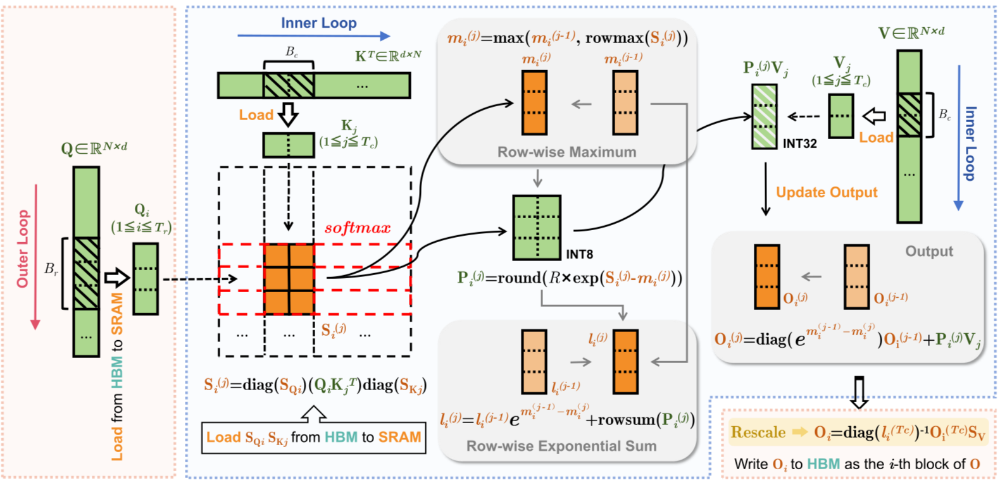

[](../../)

## [](../../main_page/GenAI)

FlashAttention is a pivotal innovation that addresses one of the most fundamental bottlenecks in the Transformer architecture. Unlike architectural changes like MoE or GQA, FlashAttention is a groundbreaking *implementation* that doesn't change the mathematics of attention but radically alters *how* it's computed on the hardware.

Here is a full, detailed tutorial on FlashAttention.

***


*Fig 1: Left: FlashAttention uses tiling to prevent materialization of the large $$𝑁 \times 𝑁$$ attention matrix
(dotted box) on (relatively) slow GPU high bandwidth memory(HBM). In the outer loop (red arrows), FlashAttention loops through
blocks of the $K$ and $V$ matrices and loads them to fast on-chip SRAM. In each block, FlashAttention
loops over blocks of $Q$ matrix (blue arrows), loading them to SRAM, and writing the output of the attention
computation back to HBM. Right: Speedup over the PyTorch implementation of attention on GPT-2.
FlashAttention does not read and write the large $$𝑁 \times 𝑁$$ attention matrix to HBM, resulting in an 7.6$\times$
speedup on the attention computation.*

## A Deep Dive into FlashAttention: Fixing the Transformer's Memory Bottleneck

For years, the attention mechanism's performance was not limited by the raw processing power (FLOPs) of GPUs, but by a much more mundane constraint: the speed of memory access. Standard implementations of attention were notoriously "memory-bound." **FlashAttention** is a landmark algorithm that solves this by re-engineering the attention computation to be aware of the GPU's memory hierarchy, resulting in massive speedups and memory savings without changing the output.

This tutorial explores the problem FlashAttention solves, its core technical innovations, and its impact on the modern LLM landscape as of mid-2025.

### 1. The Bottleneck: Why Standard Attention is "Memory-Bound"

To understand FlashAttention, we must first understand the "memory wall" that standard attention hits.

#### The GPU Memory Hierarchy
A modern GPU has two main types of memory:
1.  **High-Bandwidth Memory (HBM):** This is the large, main memory of the GPU (e.g., 24GB, 40GB, 80GB). It's like a computer's main hard drive—spacious but relatively slow to access.
2.  **SRAM (Static Random-Access Memory):** This is an extremely fast, on-chip memory available in small amounts (e.g., a few dozen megabytes). It's like a CPU's L1/L2 cache—blazing fast but very limited in size.

The key to high performance on a GPU is to do as much work as possible in SRAM without constantly reading from and writing to the slower HBM.

#### The Inefficient Memory Pattern of Standard Attention
Let's look at the standard attention formula, $O = \text{softmax}(\frac{QK^T}{\sqrt{d_k}})V$, and how it's typically executed. Let the sequence length be `N` and head dimension be `d`.

1.  **Load Inputs:** The `Q`, `K`, and `V` matrices (size $N \times d$) are loaded from HBM into the GPU's compute cores.
2.  **Compute Attention Scores:** The first major operation is $S = QK^T$. This produces a massive intermediate matrix of size $N \times N$.
3.  **The Memory Wall (Write #1):** The entire $N \times N$ matrix `S` is **written back to HBM**. This is the single biggest bottleneck. For a sequence length of 64k, this matrix is $64k \times 64k$, which is over 16GB of memory for just one head in one layer!
4.  **Load for Softmax (Read #1):** The same $N \times N$ matrix `S` is **read back from HBM** to apply the softmax.
5.  **Compute Softmax:** The softmax operation is performed, creating another $N \times N$ matrix, `P`.
6.  **The Memory Wall (Write #2):** This new matrix `P` is **written back to HBM**.
7.  **Load for Final Output (Read #2):** The matrix `P` and the `V` matrix are **read from HBM**.
8.  **Compute Output:** The final output $O = PV$ is computed.
9.  **Final Write:** The output `O` is written to HBM.

The process is dominated by slow read/write operations to HBM. The GPU spends more time waiting for data to move than it does performing actual calculations. This is the definition of a **memory-bound** operation.

### 2. The FlashAttention Solution: Kernel Fusion and Hardware Awareness

The core idea of FlashAttention is simple but powerful: **never write the full $N \times N$ attention matrix to HBM.** It achieves this by fusing the separate steps of attention into a single "kernel" (a single GPU operation) that intelligently uses fast SRAM.

But how can you do this if the $N \times N$ matrix is too large to fit in the small SRAM? This is where the two key breakthroughs of FlashAttention come in.

#### Technique 1: Tiling
FlashAttention breaks the large Q, K, and V matrices into smaller blocks, or "tiles." It then iterates through these blocks, loading them into SRAM and performing partial calculations.

* **Analogy: Multiplying Huge Matrices on a Small Whiteboard** 칠판
    Imagine you need to multiply two enormous matrices but only have a small whiteboard (SRAM). You can't write down the full matrices. Instead, you:
    1.  Copy a few rows from the first matrix and a few columns from the second onto your whiteboard.
    2.  Compute their partial product on the whiteboard.
    3.  Keep a running sum of these partial products in a separate notebook, clearing the whiteboard for the next set of rows and columns.

FlashAttention does exactly this. It loads blocks of `Q`, `K`, and `V` into SRAM, computes the attention output for just those blocks, and accumulates the result without ever storing the full attention matrix in HBM.

#### Technique 2: Online Softmax (Recomputation)
The standard softmax function needs to see an entire row of the attention score matrix `S` to compute its normalization factor (the sum of all exponentials in that row). Tiling seems to break this, as we only have one block of a row in SRAM at a time.

FlashAttention solves this with a clever numerical trick. As it iterates through the blocks of `K` and `V` for a given block of `Q`, it keeps track of the running softmax statistics for each row:

1.  It computes the dot products for the current block, getting a partial row of scores.
2.  It finds the maximum value in this partial row.
3.  If this new maximum is greater than the running maximum from previous blocks, it knows all its previous calculations need to be rescaled.
4.  It applies this rescaling factor to its running sum of exponentials and then adds the contribution from the current block.

This allows it to arrive at the **exact same final result** as a standard softmax, but without ever needing the full row to be materialized in memory at once. It effectively "recomputes" the normalization factor as it gets more information, saving a massive amount of memory access.

### 3. Full Complexity Analysis

FlashAttention's brilliance is that it reduces memory complexity without changing the total number of FLOPs.

* **Standard Attention:**
    * **Memory Complexity:** $O(N^2)$. Dominated by storing the intermediate $N \times N$ matrices (`S` and `P`) in HBM.
    * **Time Complexity (FLOPs):** $O(N^2 d)$. The total number of mathematical operations is fixed. The runtime is slow due to HBM access, not the number of FLOPs.

* **FlashAttention:**
    * **Memory Complexity:** $O(Nd)$. The memory usage is **linear** with sequence length `N` because the $N \times N$ matrix is never created in HBM. The memory required is just for storing the inputs and outputs. This is a groundbreaking improvement.
    * **Time Complexity (FLOPs):** $O(N^2 d)$. The total number of mathematical operations is roughly the same. However, the **wall-clock runtime is much faster (2-4x or more)** because the operations are not bottlenecked by HBM reads/writes.

### 4. Code Implementation: Usage, Not Source Code

FlashAttention is not a simple Python function; it is a highly optimized kernel written in low-level languages like CUDA and Triton to directly control the GPU's hardware. Therefore, you cannot implement it yourself in a few lines of PyTorch.

Instead, you use it as a drop-in replacement for the standard attention function, provided by libraries like the official `flash-attn` package.

Here’s how you would use it in practice, showing how it can replace a standard attention implementation.

```python
import torch
import torch.nn as nn
import torch.nn.functional as F

# Try to import the flash_attn function
try:
    from flash_attn.flash_attn_func import flash_attn_func
    FLASH_AVAILABLE = True
    print("FlashAttention is available.")
except ImportError:
    FLASH_AVAILABLE = False
    print("FlashAttention is not installed. Using standard PyTorch attention.")


class MyAttention(nn.Module):
    def __init__(self, d_model: int, num_heads: int, use_flash: bool = True):
        super().__init__()
        self.d_model = d_model
        self.num_heads = num_heads
        self.d_head = d_model // num_heads
        self.use_flash = use_flash and FLASH_AVAILABLE

        self.qkv_proj = nn.Linear(d_model, 3 * d_model)
        self.out_proj = nn.Linear(d_model, d_model)

    def forward(self, x: torch.Tensor):
        B, L, _ = x.shape
        
        # Project to Q, K, V
        q, k, v = self.qkv_proj(x).chunk(3, dim=-1)

        if self.use_flash:
            # Reshape for FlashAttention: (B, L, H, d_k)
            q = q.view(B, L, self.num_heads, self.d_head)
            k = k.view(B, L, self.num_heads, self.d_head)
            v = v.view(B, L, self.num_heads, self.d_head)

            # Use the fused FlashAttention kernel
            # It handles the softmax and attention calculation internally
            context = flash_attn_func(q, k, v, causal=True) # causal=True for decoder-style masking
            
            # Reshape back to (B, L, d_model)
            context = context.view(B, L, self.d_model)

        else: # Standard PyTorch implementation
            # Reshape for standard attention: (B, H, L, d_k)
            q = q.view(B, L, self.num_heads, self.d_head).transpose(1, 2)
            k = k.view(B, L, self.num_heads, self.d_head).transpose(1, 2)
            v = v.view(B, L, self.num_heads, self.d_head).transpose(1, 2)
            
            # This is where the N x N matrix is created internally
            context = F.scaled_dot_product_attention(q, k, v, is_causal=True)
            
            # Reshape back to (B, L, d_model)
            context = context.transpose(1, 2).contiguous().view(B, L, self.d_model)

        return self.out_proj(context)

# Example:
# model = MyAttention(d_model=512, num_heads=8, use_flash=True)
# input_tensor = torch.randn(4, 8192, 512).cuda() # Batch=4, SeqLen=8192
# output = model(input_tensor) # This will use the fast path if available
```

### 5. Key Reference

The algorithm and its impact were detailed in a groundbreaking paper from Stanford University. A follow-up paper introduced FlashAttention-2, which further optimized the kernel for even greater performance.

* **Canonical Paper:** Dao, T., Fu, D. Y., Ermon, S., et al. (2022). *FlashAttention: Fast and Memory-Efficient Exact Attention with IO-Awareness*. arXiv preprint arXiv:2205.14135.
* **Successor:** Dao, T. (2023). *FlashAttention-2: Faster Attention with Better Parallelism and Work Partitioning*. arXiv preprint arXiv:2307.08691.
