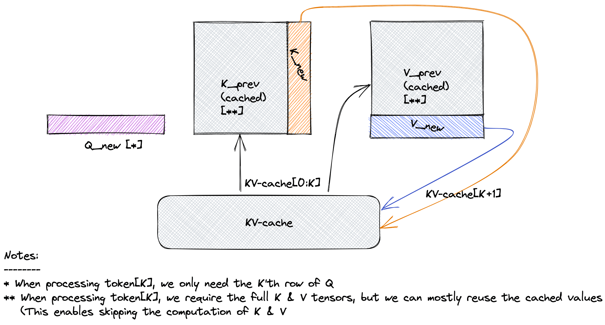

[](../../)

## [](../../main_page/GenAI)

## The Ultimate Guide to the KV Cache: Speeding up Transformer Inference
*Last Updated: June 12, 2025*

Generative Large Language Models (LLMs) have transformed technology, but their power comes at a cost: inference (the process of generating new text) can be slow. The primary bottleneck is the "autoregressive" way they produce text—one token at a time. A simple but profound optimization called the **KV Cache** is the key to making this process practical and fast.

This tutorial will give you a deep understanding of what the KV Cache is, the critical reason why we only cache Keys (K) and Values (V) but not Queries (Q), and how to implement it in code.

### 1. The Challenge: Redundant Work in Autoregressive Decoding

Transformers work by attending to their entire context. When generating the next token, the model must consider all the tokens that came before it.

Imagine generating the sentence: "The quick brown fox".
* To generate "quick", the model processes "The".
* To generate "brown", the model processes "The quick".
* To generate "fox", the model processes "The quick brown".

The naive approach would be to re-process the entire preceding sequence at every single step.

| Generation Step | Input to Model | Computation |
| :--- | :--- | :--- |
| 1. Generate "quick" | "The" | Process 1 token |
| 2. Generate "brown" | "The quick" | Process 2 tokens |
| 3. Generate "fox" | "The quick brown" | Process 3 tokens |
| 4. Generate "jumps" | "The quick brown fox" | Process 4 tokens |

Notice the massive redundancy. To generate "jumps", we re-calculate the internal representations for "The", "quick", "brown", and "fox", even though we just did so in the previous steps. For a sequence of length $L$, this naive method performs $O(L^2)$ work at each step, making generation prohibitively slow.

### 2. The Core Question: Why Cache K and V, but Not Q?

The attention mechanism is defined as:
$$\text{Attention}(Q, K, V) = \text{softmax}\left(\frac{Q K^T}{\sqrt{d_k}}\right)V$$

The KV Cache is built on a simple observation: the "Key" and "Value" for a given token, once calculated, never change. The role token #3 ("brown") plays in the sequence is fixed. However, the "Query" is always generated by the *current* token we are considering, making it dynamic.

Let's break this down with both intuition and math.

#### The Intuitive Reason: The "Library and Seeker" Analogy

Think of the attention mechanism as a researcher ("Seeker") looking for information in a library.

* **Keys (K) and Values (V) are the "Library"**:
    * The **Keys** are the library's card catalog or index. Each past token creates a "Key" that says, "This is the type of information I represent."
    * The **Values** are the actual content in the books on the shelves. Each past token creates a "Value" that holds its rich semantic information.
    * Once a token is part of the context (a book is on the shelf), its index card (Key) and content (Value) are **static and unchanging**. They can be put into a cache for quick retrieval.

* **The Query (Q) is the "Seeker"**:
    * The **Query** is the active search request generated by the **newest token**. It's the researcher saying, "Based on my current topic, I need to find relevant information."
    * This "search request" is unique to each generation step. The query for generating "fox" (based on "The quick brown") is different from the query for generating "jumps" (based on "The quick brown fox").
    * Therefore, the Query is **transient and context-dependent**. It must be calculated fresh at every step. Caching the Query would be like using yesterday's search term to find today's information—it wouldn't make sense.

You always use a *new query* to search an *ever-growing, cached library*.



#### The Mathematical Reason: The Flow of Information

Let's trace the generation of token $t$, assuming we have already processed tokens $1$ through $t-1$.

1.  **Inputs at Step `t`:**
    * The embedding of the newest token: $x_t$.
    * The cached Keys from all past steps: $K_{cache} = [k_1, k_2, \dots, k_{t-1}]$.
    * The cached Values from all past steps: $V_{cache} = [v_1, v_2, \dots, v_{t-1}]$.

2.  **Calculations at Step `t`:**
    * **Generate the NEW Query:** The query is computed *only* from the current token's embedding, $x_t$. This is the "seeker."
        $$q_t = x_t W^Q$$
    * **Generate the NEW Key and Value:** These are also computed from the current token's embedding.
        $$k_t = x_t W^K$$       $$v_t = x_t W^V$$
    * **Update the Cache:** Append the new key and value to the cached ones. This is the "growing library."
        $$K_{total} = \text{Concat}(K_{cache}, k_t) = [k_1, \dots, k_{t-1}, k_t]$$       $$V_{total} = \text{Concat}(V_{cache}, v_t) = [v_1, \dots, v_{t-1}, v_t]$$
        These updated `K_total` and `V_total` tensors will become the cache for step $t+1$.

3.  **Perform Attention:** The new query $q_t$ attends to the **entire set of keys**, and the resulting weights are applied to the **entire set of values**.
    $$\text{scores}_t = \frac{q_t \cdot K_{total}^T}{\sqrt{d_k}}$$   $$\text{output}_t = \text{softmax}(\text{scores}_t) \cdot V_{total}$$

This mathematical flow proves the concept: $q_t$ is computed fresh and used once per step, while $K_{total}$ and $V_{total}$ are cumulative and persistent. There is no mathematical role for a "Query cache."

### 3. A Practical Code Implementation

Here is a simplified PyTorch module demonstrating self-attention with a KV Cache.

```python
import torch
import torch.nn as nn
from typing import Optional, Tuple

class AttentionWithKVCache(nn.Module):
    def __init__(self, d_model, num_heads):
        super().__init__()
        assert d_model % num_heads == 0
        self.d_model = d_model
        self.num_heads = num_heads
        self.d_head = d_model // num_heads

        self.q_proj = nn.Linear(d_model, d_model)
        self.k_proj = nn.Linear(d_model, d_model)
        self.v_proj = nn.Linear(d_model, d_model)
        self.out_proj = nn.Linear(d_model, d_model)

    def forward(
        self,
        x: torch.Tensor, # Input for the current step: (B, 1, d_model)
        kv_cache: Optional[Tuple[torch.Tensor, torch.Tensor]] = None
    ) -> Tuple[torch.Tensor, Tuple[torch.Tensor, torch.Tensor]]:
        """
        Args:
            x: The input tensor for the current token(s).
            kv_cache: A tuple containing the cached keys and values from previous steps.

        Returns:
            A tuple containing the output tensor and the updated KV cache.
        """
        batch_size, seq_len, _ = x.shape # seq_len is 1 during generation

        # 1. Calculate Q, K, V for the current token
        q = self.q_proj(x).view(batch_size, seq_len, self.num_heads, self.d_head).transpose(1, 2)
        k_new = self.k_proj(x).view(batch_size, seq_len, self.num_heads, self.d_head).transpose(1, 2)
        v_new = self.v_proj(x).view(batch_size, seq_len, self.num_heads, self.d_head).transpose(1, 2)
        
        # 2. Update the cache
        if kv_cache is not None:
            # Retrieve cached keys and values
            k_cached, v_cached = kv_cache
            # Prepend cached K and V to the new K and V
            k_total = torch.cat([k_cached, k_new], dim=2)
            v_total = torch.cat([v_cached, v_new], dim=2)
        else:
            # This is the first step, so the cache is just the new K and V
            k_total = k_new
            v_total = v_new

        # The updated cache for the next step
        updated_kv_cache = (k_total, v_total)

        # 3. Perform attention
        # q is (B, H, 1, d_k)
        # k_total.transpose is (B, H, d_k, L_total)
        # scores is (B, H, 1, L_total)
        scores = torch.matmul(q, k_total.transpose(-2, -1)) / (self.d_head ** 0.5)
        attn_weights = torch.softmax(scores, dim=-1)
        
        # attn_weights is (B, H, 1, L_total)
        # v_total is (B, H, L_total, d_k)
        # output is (B, H, 1, d_k)
        context = torch.matmul(attn_weights, v_total)

        # 4. Project output
        context = context.transpose(1, 2).contiguous().view(batch_size, seq_len, self.d_model)
        output = self.out_proj(context)
        
        return output, updated_kv_cache

# --- Example Generation Loop ---
if __name__ == '__main__':
    d_model = 512
    num_heads = 8
    batch_size = 1
    
    attention_layer = AttentionWithKVCache(d_model, num_heads)
    
    # Let's simulate generating 5 tokens
    generated_sequence_len = 5
    
    # Start with a single "start-of-sequence" token
    input_token = torch.randn(batch_size, 1, d_model)
    
    cache = None
    print("--- Running Generation with KV Cache ---")
    for i in range(generated_sequence_len):
        output, cache = attention_layer(input_token, kv_cache=cache)
        
        # In a real model, this output would be fed to a classifier
        # to predict the next token ID. We'll just simulate it.
        print(f"Step {i+1}:")
        print(f"  Input shape: {input_token.shape}")
        print(f"  Cache K shape: {cache[0].shape}") # Should grow in sequence length
        print(f"  Cache V shape: {cache[1].shape}")
        print(f"  Output shape: {output.shape}")
        
        # The next input is a new token (we simulate it with random data)
        input_token = torch.randn(batch_size, 1, d_model)

```

### 4. Conclusion: The Impact of Caching

The KV Cache is a cornerstone of modern generative AI. By eliminating redundant computations, it fundamentally changes the complexity of autoregressive decoding.

* **Without Cache:** Each step requires processing the entire sequence, making the operation per step effectively $O(L^2)$.
* **With Cache:** Each step requires only a single forward pass for the new token and an attention calculation over the cached sequence. This reduces the complexity per step to $O(L)$, as the sequence length `L` grows.

This simple yet powerful mechanism is what allows models with context windows of hundreds of thousands of tokens to generate text at a reasonable speed, making real-time chatbots, copilots, and other generative applications possible.

---
### References

1.  **Original Transformer:** Vaswani, A., Shazeer, N., Parmar, N., Uszkoreit, J., Jones, L., Gomez, A. N., Kaiser, Ł., & Polosukhin, I. (2017). *Attention Is All You Need*. Advances in Neural Information Processing Systems 30 (NIPS 2017). *(While not explicitly named the "KV Cache," this paper's description of self-attention in decoders lays the entire foundation for this optimization).*
2.  **Efficient Transformers:** Tay, Y., Dehghani, M., Bahri, D., & Metzler, D. (2020). *Efficient Transformers: A Survey*. arXiv preprint arXiv:2009.06732. *(This survey covers various efficiency techniques, including those related to inference and memory, providing broader context).*
