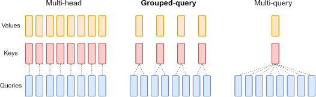

Of course. Here is the updated tutorial with more mathematical depth, code snippets, and a more detailed analysis of the KV cache reduction for each attention variant.

***

## A Deep Dive into Multi-Query and Grouped-Query Attention (MQA & GQA) [Updated]

The Transformer architecture's self-attention mechanism is the engine of modern AI. However, as models and their context windows grow, the computational and memory costs of standard Multi-Head Attention (MHA) become a significant bottleneck, especially during inference.

This tutorial provides an in-depth exploration of two powerful solutions: **Multi-Query Attention (MQA)** and **Grouped-Query Attention (GQA)**. Understanding these architectural details, including their mathematical foundations and impact on memory, is essential for grasping how models like Google's Gemini, Meta's Llama 3, and Mistral AI's models operate so efficiently.


*Fig.2: KV caching in the sequence2sequence Transformer architectures*

### A Deeper Look at the KV Cache

To understand MQA and GQA, one must first understand the **KV Cache**.

During autoregressive decoding (generating text token by token), the model needs to "look back" at all previously generated tokens to decide the next one. Let's say we are generating the $t$-th token. Its Query vector, $q_t$, must attend to the Key and Value vectors of all previous tokens, $\{k_1, v_1\}, \{k_2, v_2\}, \dots, \{k_{t-1}, v_{t-1}\}$, as well as its own, $\{k_t, v_t\}$.

Without a cache, at each step $t$, we would have to re-calculate the K and V vectors for all preceding $t-1$ tokens. This is incredibly redundant and inefficient.

The **KV Cache** solves this by storing the Key and Value vectors for all tokens in the context window as they are generated. At step $t$, we simply calculate $k_t$ and $v_t$, append them to our cache, and perform the attention calculation using the full cache.

The bottleneck then shifts from computation to **memory bandwidth**. At every single generation step, the entire KV cache must be loaded from slow High-Bandwidth Memory (HBM) into the fast on-chip SRAM of the processor. This memory transfer is the primary factor limiting inference speed. The goal of MQA and GQA is to shrink this cache.

---

### Part 1: Revisiting Multi-Head Attention (MHA)

MHA is the foundational attention mechanism.

* **Mathematical Formulation:** Given an input sequence representation $X \in \mathbb{R}^{n \times d_{model}}$, MHA first projects it into $H$ sets of queries, keys, and values using distinct weight matrices for each head $i \in \{1, \dots, H\}$:
    * Query: $Q_i = X W_i^Q$, where $W_i^Q \in \mathbb{R}^{d_{model} \times d_k}$
    * Key: $K_i = X W_i^K$, where $W_i^K \in \mathbb{R}^{d_{model} \times d_k}$
    * Value: $V_i = X W_i^V$, where $W_i^V \in \mathbb{R}^{d_{model} \times d_v}$

    The output of each head is then calculated, concatenated, and projected back:
    $$\text{head}_i = \text{Attention}(Q_i, K_i, V_i) = \text{softmax}\left(\frac{Q_i K_i^T}{\sqrt{d_k}}\right)V_i$$
    $$\text{MHA}(X) = \text{Concat}(\text{head}_1, \dots, \text{head}_H)W^O$$

* **KV Cache Size:** The total size is determined by the Key and Value tensors across all heads and layers.
    $$C_{MHA} = 2 \times B \times L \times N_{layers} \times H \times d_k$$
    Where:
    * `2`: For storing both K and V tensors.
    * `B`: Batch size.
    * `L`: Sequence length.
    * `N_layers`: Number of transformer layers.
    * `H`: Number of attention heads.
    * `d_k`: Dimension of each head.

---



*Fig. 2 Overview of grouped-query method. Multi-head attention has H query, key, and value heads. Multi-query
attention shares single key and value heads across all query heads. Grouped-query attention instead shares single
key and value heads for each group of query heads, interpolating between multi-head and multi-query attention.*

### Part 2: Multi-Query Attention (MQA)

MQA aggressively shrinks the KV cache by sharing one K/V head across all query heads.

* **Mathematical Formulation:** MQA retains $H$ distinct Query heads but uses only a single Key and Value projection matrix, shared across all heads.
    * Query: $Q_i = X W_i^Q$ (for $i=1, \dots, H$)
    * Key: $K = X W^K$ (**one for all heads**)
    * Value: $V = X W^V$ (**one for all heads**)

    The attention calculation for each head then uses the same K and V:
    $$\text{head}_i = \text{Attention}(Q_i, K, V) = \text{softmax}\left(\frac{Q_i K^T}{\sqrt{d_k}}\right)V$$

* **KV Cache Reduction:**
    Since there is only one K/V head, the cache size formula becomes:
    $$C_{MQA} = 2 \times B \times L \times N_{layers} \times \mathbf{1} \times d_k$$
    The reduction factor compared to MHA is simply the number of heads, $H$.
    $$\frac{C_{MHA}}{C_{MQA}} = H$$
    For a model with 32 attention heads, **MQA reduces the KV cache size by a factor of 32**, leading to a massive speedup in inference.

* **Code Snippet (PyTorch):**

    ```python
    import torch
    import torch.nn as nn

    class MultiQueryAttention(nn.Module):
        def __init__(self, d_model, num_heads):
            super().__init__()
            assert d_model % num_heads == 0
            self.d_model = d_model
            self.num_heads = num_heads
            self.d_head = d_model // num_heads

            self.q_proj = nn.Linear(d_model, d_model) # Projects all Q heads at once
            # Only one projection for K and one for V
            self.k_proj = nn.Linear(d_model, self.d_head)
            self.v_proj = nn.Linear(d_model, self.d_head)
            self.out_proj = nn.Linear(d_model, d_model)

        def forward(self, x):
            batch_size, seq_len, _ = x.shape

            # Project and reshape Q into H heads
            q = self.q_proj(x).view(batch_size, seq_len, self.num_heads, self.d_head).transpose(1, 2)
            # Project K and V (result has no head dimension yet)
            k = self.k_proj(x).view(batch_size, seq_len, 1, self.d_head).transpose(1, 2)
            v = self.v_proj(x).view(batch_size, seq_len, 1, self.d_head).transpose(1, 2)

            # Manually repeat K and V for each of the H query heads
            # This is often optimized at the CUDA kernel level to avoid explicit memory duplication
            # k = k.repeat(1, self.num_heads, 1, 1)
            # v = v.repeat(1, self.num_heads, 1, 1)

            # Attention calculation is now broadcast-compatible
            # Q: (B, H, L, d_k), K.T: (B, 1, d_k, L) -> Scores: (B, H, L, L)
            scores = torch.matmul(q, k.transpose(-2, -1)) / (self.d_head ** 0.5)
            attn = torch.softmax(scores, dim=-1)

            # V: (B, 1, L, d_k)
            output = torch.matmul(attn, v) # Output: (B, H, L, d_k)
            
            # Concatenate heads and project out
            output = output.transpose(1, 2).contiguous().view(batch_size, seq_len, self.d_model)
            return self.out_proj(output)
    ```

---

### Part 3: Grouped-Query Attention (GQA)

GQA provides a balance, grouping Query heads and assigning a single K/V head to each group.

* **Mathematical Formulation:** The $H$ Query heads are partitioned into $G$ groups, with $H/G$ heads per group. There are $G$ distinct Key and Value heads. Let $g(i)$ be the group index for query head $i$.
    * Query: $Q_i = X W_i^Q$ (for $i=1, \dots, H$)
    * Key: $K_{g(i)} = X W_{g(i)}^K$ (**one per group**)
    * Value: $V_{g(i)} = X W_{g(i)}^V$ (**one per group**)

    The attention for head $i$ uses the K and V from its assigned group $g(i)$:
    $$\text{head}_i = \text{Attention}(Q_i, K_{g(i)}, V_{g(i)})$$

* **KV Cache Reduction:**
    With $G$ Key/Value heads, the cache size is:
    $$C_{GQA} = 2 \times B \times L \times N_{layers} \times \mathbf{G} \times d_k$$
    The reduction factor compared to MHA is the number of heads per group.
    $$\frac{C_{MHA}}{C_{GQA}} = \frac{H}{G}$$
    For example, the Llama 2 7B model uses $H=32$ Query heads and $G=4$ KV heads. The KV cache is reduced by a factor of $32/4 = 8$, offering a substantial speedup while maintaining high model quality.

* **Code Snippet (PyTorch):**

    ```python
    import torch
    import torch.nn as nn

    class GroupedQueryAttention(nn.Module):
        def __init__(self, d_model, num_heads, num_kv_heads):
            super().__init__()
            assert d_model % num_heads == 0
            assert num_heads % num_kv_heads == 0
            self.d_model = d_model
            self.num_heads = num_heads
            self.num_kv_heads = num_kv_heads
            self.num_queries_per_kv = num_heads // num_kv_heads
            self.d_head = d_model // num_heads

            self.q_proj = nn.Linear(d_model, d_model)
            # K and V projections are smaller now
            self.k_proj = nn.Linear(d_model, self.num_kv_heads * self.d_head)
            self.v_proj = nn.Linear(d_model, self.num_kv_heads * self.d_head)
            self.out_proj = nn.Linear(d_model, d_model)

        def forward(self, x):
            batch_size, seq_len, _ = x.shape

            # Project Q, K, V
            q = self.q_proj(x).view(batch_size, seq_len, self.num_heads, self.d_head).transpose(1, 2)
            k = self.k_proj(x).view(batch_size, seq_len, self.num_kv_heads, self.d_head).transpose(1, 2)
            v = self.v_proj(x).view(batch_size, seq_len, self.num_kv_heads, self.d_head).transpose(1, 2)
            
            # Repeat K and V heads to match the number of Q heads in each group
            # From (B, G, L, d_k) to (B, G, N_rep, L, d_k)
            k = k.unsqueeze(2).repeat(1, 1, self.num_queries_per_kv, 1, 1)
            v = v.unsqueeze(2).repeat(1, 1, self.num_queries_per_kv, 1, 1)
            # Reshape to (B, H, L, d_k) where H = G * N_rep
            k = k.view(batch_size, self.num_heads, seq_len, self.d_head)
            v = v.view(batch_size, self.num_heads, seq_len, self.d_head)

            # Attention calculation
            scores = torch.matmul(q, k.transpose(-2, -1)) / (self.d_head ** 0.5)
            attn = torch.softmax(scores, dim=-1)
            output = torch.matmul(attn, v)
            
            output = output.transpose(1, 2).contiguous().view(batch_size, seq_len, self.d_model)
            return self.out_proj(output)
    ```

---

### Comparison Summary

| Feature | Multi-Head (MHA) | Grouped-Query (GQA) | Multi-Query (MQA) |
| :--- | :--- | :--- | :--- |
| **# Q Heads** | `H` | `H` | `H` |
| **# K/V Heads** | `H` | `G` (where `1 < G < H`) | `1` |
| **KV Cache Reduction Factor** | 1x (Baseline) | `H / G` | `H` |
| **Inference Speed** | Slowest | Fast | Fastest |
| **Model Quality** | Highest (Baseline) | Nearly as high as MHA | Can be slightly lower |
| **Best For** | Max performance (if memory allows) | **The modern standard for LLMs** | Extreme memory constraints |

### Conclusion

The evolution from MHA to GQA is a story of pragmatic engineering. GQA masterfully balances the expressive power of having many attention heads with the practical necessity of a small memory footprint for fast inference. By grouping query heads, it achieves most of the speed benefits of MQA while retaining nearly all the model quality of MHA, solidifying its place as a cornerstone of today's state-of-the-art language models.

---

### References

1.  **GQA (Canonical Paper):** Ainslie, J., Lee-Thorp, J., de Jong, M., Zemlyanskiy, Y., Le, Q., & Sanghai, S. (2023). *GQA: Training Generalized Multi-Query Transformer Models from Multi-Head Checkpoints*. arXiv preprint arXiv:2305.13245.
2.  **MQA (Conceptual Origin):** Shazeer, N. (2019). *Fast Transformer Decoding: One Write-Head is All You Need*. arXiv preprint arXiv:1911.02150.
3.  **Original Transformer (Foundation):** Vaswani, A., Shazeer, N., Parmar, N., Uszkoreit, J., Jones, L., Gomez, A. N., Kaiser, Ł., & Polosukhin, I. (2017). *Attention Is All You Need*. Advances in Neural Information Processing Systems 30 (NIPS 2017).
