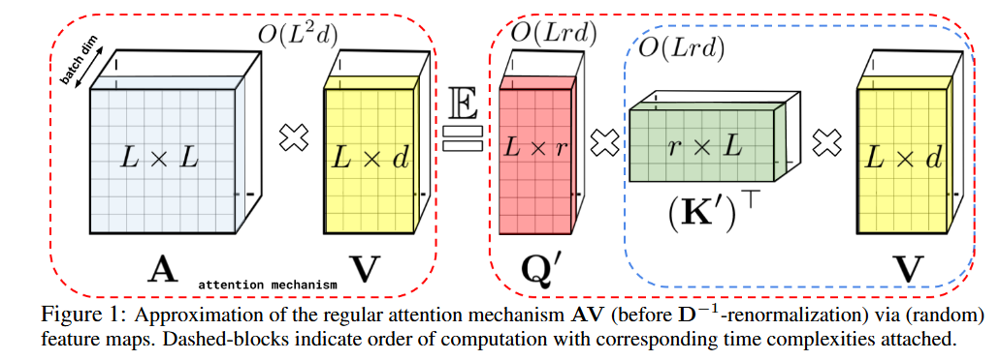

[](../../)

## [](../../main_page/GenAI)

# Kernel-Based Attention and the Performer: Full Tutorial

Performers are Transformer architectures which can estimate regular (softmax) full-rank-attention Transformers with provable accuracy, but using only linear (as opposed to quadratic) space and time complexity, without relying on any priors such as sparsity or low-rankness. To approximate softmax attentionkernels, Performers use a novel Fast Attention Via positive Orthogonal Random features approach (FAVOR+), which may be of independent interest for scalable kernel methods. FAVOR+ can also be used to efficiently model kernelizable attention mechanisms beyond softmax. This representational power is crucial to accurately compare softmax with other kernels for the first time on large-scale tasks, beyond the reach of regular Transformers, and investigate optimal attention-kernels. Performers are linear architectures fully compatible with regular Transformers and with strong theoretical guarantees: unbiased or nearly-unbiased estimation of the attention matrix, uniform convergence and low estimation variance. We tested Performers on a rich set of tasks stretching from pixel-prediction through text models to protein sequence modeling. Performer demonstrates competitive results with other examined efficient sparse and dense attention methods, showcasing effectiveness of the novel attention-learning paradigm leveraged by Performers.
## 1. What Is a Kernel?

A **kernel** is a function that computes similarity between two inputs in a possibly high- or infinite-dimensional space without explicitly transforming the data. Formally:

$$
k(x, x') = \langle \phi(x), \phi(x') \rangle_\mathcal{H}
$$

where:

* $\phi: \mathbb{R}^d \rightarrow \mathcal{H}$ is a feature map,
* $\mathcal{H}$ is a (possibly infinite) Hilbert space,
* $\langle \cdot, \cdot \rangle$ is the inner product in $\mathcal{H}$.

### Examples of Kernels and Their Feature Maps

| Kernel Name        | Formula                                 | Feature Map $\phi(x)$        | Dimensionality |
| ------------------ | --------------------------------------- | ---------------------------- | -------------- |
| Linear             | $x^\top x'$                             | $x$                          | $d$            |
| Polynomial (deg=d) | $(x^\top x' + c)^d$                     | Monomials of degree $\leq d$ | $O(d^p)$       |
| Cosine             | $\frac{x^\top x'}{\|x\|\|x'\|}$         | $\frac{x}{\|x\|}$            | $d$            |
| RBF (Gaussian)     | $\exp(-\frac{\|x - x'\|^2}{2\sigma^2})$ | Infinite-dimensional         | $\infty$       |

---

## 2. Random Fourier Features (RFF)

For shift-invariant kernels $k(x - x')$, **Bochner's theorem** tells us:

> A continuous, shift-invariant, positive-definite kernel is the Fourier transform of a non-negative probability distribution.

So:

$$
k(x, x') = \int e^{i\omega^\top(x - x')} p(\omega) \, d\omega = \mathbb{E}_{\omega \sim p(\omega)}[e^{i\omega^\top x} e^{-i\omega^\top x'}]
$$

Using Euler's formula:

$$
e^{i\theta} = \cos \theta + i \sin \theta
$$

So:

$$
k(x, x') = \mathbb{E}_\omega[\cos(\omega^\top x - \omega^\top x')] = \mathbb{E}_\omega[\cos(\omega^\top x) \cos(\omega^\top x') + \sin(\omega^\top x) \sin(\omega^\top x')]
$$

This suggests a 2D feature map:

$$
\phi_\omega(x) = \begin{bmatrix} \cos(\omega^\top x) \\ \sin(\omega^\top x) \end{bmatrix}
\Rightarrow k(x, x') \approx \frac{1}{D} \sum_{j=1}^D \phi_{\omega_j}(x)^\top \phi_{\omega_j}(x')
$$

To reduce this to $D$ dimensions, we use a phase shift trick:

$$
\cos(\omega^\top x + b) \cos(\omega^\top x' + b) = \cos(\omega^\top x - \omega^\top x')
$$

when $b \sim \text{Uniform}[0, 2\pi]$. This gives:

$$
\phi(x) = \sqrt{\frac{2}{D}} \begin{bmatrix} \cos(\omega_1^\top x + b_1) \\ \vdots \\ \cos(\omega_D^\top x + b_D) \end{bmatrix}
$$

Then:

$$
k(x, x') \approx \phi(x)^\top \phi(x')
$$

For **RBF kernel**:

$$
p(\omega) = \mathcal{N}(0, \sigma^{-2} I)\text{, so sample } \omega_j \sim \mathcal{N}(0, \sigma^{-2} I)
$$

### Note on RBF Kernel and Infinite Dimensions

The RBF (Gaussian) kernel:

$$
k(x, x') = \exp\left(-\frac{\|x - x'\|^2}{2\sigma^2}\right)
$$

has **no finite-dimensional** feature map $\phi(x)$ such that $k(x, x') = \langle \phi(x), \phi(x') \rangle$. Its associated feature space is infinite-dimensional because it corresponds to an infinite sum of polynomial basis functions. The only way to handle this in practice is to **approximate it** using techniques like **Random Fourier Features (RFF)**, as shown above.

---

## 3. Performer: FAVOR+ Attention

The standard softmax attention formulation is:

$$
\text{Attention}(Q, K, V) = D^{-1} A V, \quad A = \exp\left(\frac{QK^\top}{\sqrt{d}}\right), \quad D = \text{diag}(A \mathbf{1}_L) \tag{1}
$$

The Performer approximates this using a kernel-based formulation:

$$
\text{Attention}(Q, K, V) \approx \hat{D}^{-1} (\phi(Q)(\phi(K)^\top V)), \quad \hat{D} = \text{diag}(\phi(Q)(\phi(K)^\top \mathbf{1}_L)) \tag{2}
$$

This enables linear-time complexity $O(n d)$ in sequence length.

### Step-by-Step Performer Attention

Let $Q, K, V \in \mathbb{R}^{n \times d}$, and define:

$$
\phi(x) = \sqrt{\frac{2}{D}} [\cos(\omega_1^\top x + b_1), ..., \cos(\omega_D^\top x + b_D)]^\top
$$

Then:

* $\tilde{Q} = \phi(Q) \in \mathbb{R}^{n \times D}$
* $\tilde{K} = \phi(K) \in \mathbb{R}^{n \times D}$
* $Z = \tilde{K}^\top V \in \mathbb{R}^{D \times d}$
* $A = \tilde{Q} Z \in \mathbb{R}^{n \times d}$

Also compute normalization term:

$$
\text{norm}_i = \tilde{Q}_i^\top (\tilde{K}^\top \mathbf{1}) \tag{3}
$$



### Final Output:

$$
\text{PerformerAttn}(Q, K, V)_i = \frac{\tilde{Q}_i^\top (\tilde{K}^\top V)}{\tilde{Q}_i^\top (\tilde{K}^\top \mathbf{1})} \tag{4}
$$

### Minimal Code Snippet (PyTorch-style)

```python
import torch
import math

def random_features(x, omega, b):
    # x: (batch_size, seq_len, dim)
    # omega: (dim, n_features), b: (n_features,)
    projection = torch.matmul(x, omega) + b  # shape: (batch, seq_len, n_features)
    return math.sqrt(2.0 / omega.shape[1]) * torch.cos(projection)

def performer_attention(Q, K, V, omega, b, eps=1e-6):
    Q_prime = random_features(Q, omega, b)  # (batch, seq_len, n_features)
    K_prime = random_features(K, omega, b)  # (batch, seq_len, n_features)

    KV = torch.einsum('bnd,bne->bde', K_prime, V)  # (batch, n_features, dim)
    denom = 1.0 / (torch.einsum('bnd,bd->bn', Q_prime, K_prime.sum(dim=1)) + eps).unsqueeze(-1)
    out = torch.einsum('bnd,bde->bne', Q_prime, KV) * denom
    return out  # (batch, seq_len, dim)
```

---

## 4. Advantages of Performer

| Aspect           | Performer (FAVOR+)                                  |
| ---------------- | --------------------------------------------------- |
| Complexity       | $O(n d)$ linear w\.r.t sequence length              |
| Accuracy         | High-fidelity approximation to softmax attention    |
| Memory usage     | Constant with respect to sequence length            |
| Theory           | Grounded in Bochner's theorem and RFF               |
| GPU/TPU friendly | Matrix multiplications only, no loops or recursions |

---

## 5. Summary

* Kernels let us measure similarity implicitly in high dimensions.
* Bochner’s theorem enables us to write shift-invariant kernels as expectations over Fourier features.
* Monte Carlo approximations yield explicit feature maps.
* RBF kernel cannot be represented in finite dimensions, so we approximate it using sampled random Fourier bases.
* Performer uses this machinery to **linearize attention**, scaling Transformers to long sequences efficiently.

