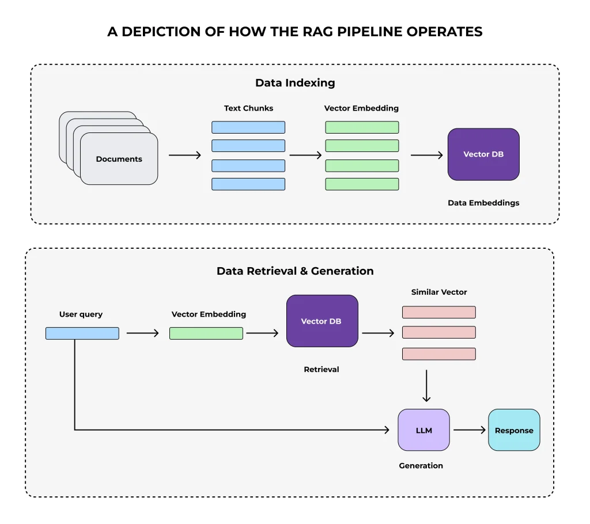

## Retrieval-Augmented Generation (RAG): From Theory to Practice

### **Part 1: The Philosophical Foundation: The Two Minds of AI**

To understand why Retrieval-Augmented Generation (RAG) is so revolutionary, we must first understand the two forms of "memory" an AI can possess. This conceptual split is the philosophical bedrock upon which RAG is built.

#### **The First Mind: Parametric Memory**

Imagine a brilliant expert—a historian, a scientist, a writer. Over years of study, they have internalized a vast amount of knowledge. This knowledge isn't stored like books on a shelf; it has been distilled into intuition, reasoning ability, and a deep, instinctual understanding of their field. They can connect disparate ideas, synthesize new theories, and write eloquently about their domain. This is **parametric memory**.

In the world of AI, a standard Large Language Model (LLM) like GPT-4 is the epitome of parametric memory. Its knowledge, acquired during an intensive training period, is encoded into its billions of parameters (the weights and biases of its neural network).

**The Strengths of Parametric Memory:**

  * **Reasoning and Synthesis:** It excels at understanding complex prompts, reasoning, summarizing, and generating fluent, coherent text.
  * **Implicit Knowledge:** It understands grammar, style, and the subtle relationships between concepts.

**The Fatal Flaws of Parametric Memory:**

1.  **Static and Stale:** The memory is frozen in time. An LLM trained until 2023 is fundamentally incapable of knowing about events that occurred in 2024. Its knowledge base becomes progressively more outdated every day.
2.  **Prone to Hallucination (Confabulation):** When the model doesn't know an answer, it doesn't stay silent. Its objective is to predict the next most probable word. This leads it to "invent" facts that sound plausible but are entirely false. This makes it fundamentally unreliable as a source of truth.
3.  **Opaque and Unverifiable:** The knowledge is diffused across its neural weights. There is no way to ask, "How do you know that?" and receive a source or citation. This lack of transparency is a major barrier to trust.

#### **The Second Mind: Non-Parametric Memory**

Now, imagine that same expert, instead of relying purely on their memory, has access to a vast, perfectly organized library filled with the latest books, research papers, and news articles. When asked a question, they can walk over to the shelf, pull out the exact book containing the answer, read the relevant passage, and then use their expertise to formulate an answer. This library is **non-parametric memory**.

It is external, discrete, and easily searchable. Its size and content can grow without changing the expert's brain.

**The RAG Breakthrough: Uniting the Two Minds**
RAG is the architectural pattern that gives the brilliant parametric mind of an LLM access to a vast, reliable, and up-to-date non-parametric memory. It separates the act of **knowing (retrieval)** from the act of **reasoning (generation)**.

The LLM is no longer forced to be an all-knowing oracle. Instead, it becomes a brilliant synthesizer of information, taking factual context provided by the retrieval system and weaving it into a precise, reliable, and verifiable answer. This hybrid approach mitigates the flaws of purely parametric models, paving the way for AI systems that are both intelligent and trustworthy.


*Fig.1 Anatomy of a sample RAG system.*


### **Part 2: The Anatomy of a RAG System: Core Components**

A RAG system is an assembly line for knowledge. Let's break down each station.

#### **Component 1: The Knowledge Base**

This is your source of truth. It can be any collection of text data: product manuals, legal documents, a company's internal Confluence pages, transcripts of customer support calls, or even the entirety of Wikipedia. This is the "library" that forms the system's non-parametric memory.

#### **Component 2: The Embedding Model (The Translator of Meaning)**

To make the text in our library searchable by meaning, we need an embedding model.

  * **Intuition:** This model converts text into a high-dimensional vector (a list of numbers), where the geometric relationships between vectors correspond to semantic relationships between the texts. The phrases "corporate financial filings" and "quarterly earnings reports" will be mapped to vectors that are very close to each other in this "embedding space."
  * **Model Structure:** These are typically **Bi-Encoders**, such as Sentence-BERT (S-BERT). A bi-encoder uses a Transformer architecture (like BERT) to process a piece of text and output a single, fixed-size vector. They are called "bi-" because during training, they process two texts (e.g., a query and a document) independently. This is crucial for RAG because it allows us to pre-compute the embeddings for all documents in our knowledge base offline, making the retrieval step incredibly fast.

#### **Component 3: The Index (The Searchable Library)**

The index is the data structure that stores the embedding vectors and allows for efficient similarity search.

  * **Intuition:** If embeddings are addresses, the index is the postal service's entire sorting and lookup system. It's designed to answer one question at lightning speed: "Given this new address, which $k$ addresses in my entire database are closest to it?"

#### **Component 4: The Retriever (The Expert Librarian)**

The retriever is the engine that drives the search process.

  * **Function:** It takes a user's query, creates an embedding from it, and queries the index to find the most relevant document chunks.
  * **Advanced Strategy - Hybrid Search:** Relying solely on vector similarity (dense retrieval) can sometimes fail if exact keywords are crucial. A more robust retriever often implements **hybrid search**. It performs two searches in parallel: a dense search for semantic similarity and a traditional keyword search (like BM25) for lexical overlap. The results from both are then combined (using a fusion algorithm like Reciprocal Rank Fusion) to produce a final, more robust ranking.

#### **Component 5: The Generator (The Master Synthesizer)**

This is the LLM. It receives the augmented prompt—a combination of the user's original query and the context retrieved by the retriever—and its sole job is to synthesize a final answer based on the provided information.

-----

### **Part 3: RAG in Action: A Step-by-Step Deep Dive**

Let's walk through the two main phases of a RAG system's life.

#### **The Indexing Pipeline (Offline - "Building the Library")**

This is the preparatory, one-time process.

1. **Document Loading & Chunking (Index Granularity):** We load our source documents. Since LLMs have a limited context window, we must chunk the documents. This is one of the most critical design choices.

     * **Fixed-Size Chunking:** The simplest method. Chop the text every $N$ characters with some overlap. It's easy but can awkwardly split sentences or ideas.
     * **Recursive Character Chunking:** A smarter method. It tries to split the text along a hierarchy of separators, like double newlines (`\n\n`), then single newlines (`\n`), then spaces (`     `). This tends to keep paragraphs and sentences intact.
     * **Semantic Chunking:** The most advanced method. It uses an embedding model to find semantic breakpoints in the text, ensuring that each chunk is as thematically coherent as possible.

2. **Embedding:** Each text chunk $c_i$ is fed through the embedding model to produce a vector $v_i$.

   $$
   v_i = \text{EmbeddingModel}(c_i)
   $$

3. **Indexing:** The vectors $v_i$ (along with a reference to the original text of $c_i$) are loaded into a vector database or search library.

#### **The Retrieval & Generation Pipeline (Online - "Answering a Question")**

This happens in real-time.

1. **Query Embedding:** The user's query $q$ is converted into a vector $v_q$ using the *same* embedding model.

   $$
   v_q = \text{EmbeddingModel}(q)
   $$

2. **Search:** The retriever sends $v_q$ to the index, which performs an **Approximate Nearest Neighbor (ANN)** search to find the $k$ document vectors that are most similar.

   $$
   \text{TopK_Indices} = \underset{i \in \{1..N\}}{\text{argmax}_k} \left( \text{CosineSimilarity}(v_q, v_i) \right)
   $$

3. **Fetch & Augment:** The system retrieves the text of the top $k$ chunks and constructs the final prompt for the LLM.

4. **Generate:** The LLM receives the augmented prompt and generates the grounded, source-based answer.

#### **Advanced Topic: RAG-Sequence vs. RAG-Token**

This distinction gets to the heart of how the generator interacts with the retriever.

  * **RAG-Sequence (Standard RAG):** The system retrieves **one set of documents** based on the initial query. The generator is then conditioned on this static set of documents to produce the entire answer. This is efficient and works for most questions.

  * **RAG-Token (More Powerful RAG):** For each **new token** the generator is about to produce, it can pause and issue a new retrieval, potentially with a refined query based on the text generated so far.

    * **Example - Multi-Hop Question:** "Who directed the movie that starred the actress who won an Oscar for her role in 'La La Land'?"
    * A RAG-Sequence model would retrieve documents about Emma Stone, 'La La Land', and its director all at once, which might be noisy.
    * A RAG-Token model could first generate "Emma Stone won an Oscar for 'La La Land'. She later starred in the movie 'Poor Things'...", then use "Poor Things" as a new retrieval query to find its director, Yorgos Lanthimos, leading to a more accurate final answer.

-----

### **Part 4: The Art of Retrieval: Architectures & Training**

The retriever is where the magic happens. A better retriever leads to better RAG.

#### **Model Structure 1: The Dual Encoder (DPR)**

This is the workhorse of dense retrieval.

  * **Architecture:** It consists of two separate Transformer towers. The Document Encoder processes every document in your library offline, creating embeddings. The Query Encoder processes the user's query in real-time. The search is a fast comparison between the query vector and the pre-computed document vectors.

#### **Model Structure 2: Late Interaction (ColBERT)**

This architecture provides higher accuracy at the cost of complexity.

  * **Architecture:** Instead of creating one vector per document, ColBERT creates a contextualized embedding for *every token* in the document. At query time, it also creates a vector for every token in the query. The "interaction" is a fine-grained comparison between every query token vector and every document token vector. This is much slower than a dual encoder but is excellent at matching specific details, making it a powerful **re-ranker** (more on this later).

#### **Training Retrievers with Contrastive Loss**

We train a dual encoder using **contrastive loss**, which teaches the model what "similarity" means.

  * **Intuition:** For a given query, we have one correct (positive) document and many incorrect (negative) documents. The training goal is to adjust the encoder weights so that the query's embedding moves closer to the positive document's embedding and farther away from all the negative documents' embeddings.

  * **Math (InfoNCE Loss):** The most common contrastive loss is InfoNCE (Noise-Contrastive Estimation). For a query $q$, a positive passage $d+$, and a set of $N$ negative passages ${d_i-}$, the loss is:

    $$
    L(q, d^+, \{d_i^-\}) = -\log \frac{e^{\text{sim}(q, d^+)/\tau}}{e^{\text{sim}(q, d^+)/\tau} + \sum_{i=1}^{N} e^{\text{sim}(q, d_i^-)/\tau}}
    $$

      * The dot product similarity is: $\text{sim}(q, d) = v\_q \cdot v\_d$.
      * The numerator represents the model's confidence in the correct pair.
      * The denominator normalizes this confidence over all pairs (the positive one and all the negative ones).
      * The goal is to make the numerator as large as possible relative to the denominator, driving the loss towards zero.
      * $\tau$ is the **temperature**. A low temperature makes the model more sensitive to differences in similarity, forcing it to work harder to distinguish the positive from the most challenging negatives.

#### **The Power of Hard Negatives**

Randomly chosen negative documents are usually easy for the model to dismiss. A **hard negative** is a document that is "confusingly similar" to the query but factually wrong. For example, for the query "What is the function of the 'clip' loss in PPO?", a hard negative might be a document describing the `huber` loss in reinforcement learning. Training with these forces the model to move beyond simple keyword matching and learn true semantic understanding.

**Methods for Mining Hard Negatives:**

1.  **In-batch Negatives:** Use the positive documents from other queries in the same training batch as negatives.
2.  **BM25 Negatives:** Use a traditional keyword search algorithm like BM25 to find documents that share keywords with the query but are known to be incorrect.
3.  **Model-Based Negatives:** Use the model itself. Find documents that the current version of the model scores highly but are known to be incorrect labels.

-----

### **Part 5: Advanced Indexing: Navigating Billions of Vectors**

A brute-force search is impossible at scale. We need **Approximate Nearest Neighbor (ANN)** algorithms.

#### **Method 1: Clustering with Inverted File Index (IVF)**

This is a popular method used by libraries like FAISS.

  * **Intuition:** Before searching, we partition the entire vector space into $n$ clusters using k-means. The result is an "inverted file" index, much like a book index, that maps each cluster to the list of vectors it contains.
  * **The Search Process:**
    1.  When a query vector arrives, we first compare it only to the $n$ cluster centroids (a very fast search).
    2.  We identify the `nprobe` closest centroids (e.g., `nprobe=10`). `nprobe` is a crucial parameter that tunes the trade-off between speed and accuracy.
    3.  We then perform an exhaustive search *only* within the documents belonging to those `nprobe` clusters. This massively reduces the search space.

#### **Method 2: Graph-Based Indexing with HNSW (Hierarchical Navigable Small Worlds)**

This is the state-of-the-art for many ANN applications.

  * **Intuition:** HNSW organizes the vectors into a multi-layered graph. The top layers contain long-range connections (like an interstate highway system), while the bottom layers contain short-range connections (like local streets). A search starts at a random entry point in the top layer, greedily navigating towards the target query. Once it can't get any closer on a higher layer, it drops down to a more granular layer below to refine the search. This hierarchical approach is incredibly fast and accurate.

-----

### **Part 6: Production-Grade RAG: System Design Choices**

#### **The Re-ranking Pattern: A Two-Stage Retrieval Pipeline**

For the highest possible quality, production systems often use a two-stage process.

1.  **Stage 1: Retrieval:** Use a fast but less accurate method (like a dual encoder with an HNSW index, or BM25) to fetch a large number of candidate documents (e.g., top 100).
2.  **Stage 2: Re-ranking:** Use a slow but highly accurate model (like a **Cross-Encoder** or **ColBERT**) to re-score *only* those 100 candidates. A cross-encoder feeds the query and document *together* into one Transformer, allowing for deep, token-level attention, which is much more powerful than a dual encoder but too slow to run on the entire corpus. This two-stage approach provides the best of both speed and accuracy.

#### **Choosing Your Vector Search System**

  * **FAISS:** Best for academic research or when you need maximum performance and are willing to build your own infrastructure around a C++ library.
  * **ElasticSearch:** Best if you are already using it for logging or text search and want to add vector capabilities. Its strength is hybrid keyword + vector search.
  * **Weaviate / Pinecone / Milvus:** Best for most production use cases. These are managed, vector-native databases that handle scaling, APIs, and advanced features like metadata filtering, saving immense engineering effort.

-----

### **Part 7: The Holy Grail: End-to-End Fine-Tuning**

While the modular RAG approach is highly effective, the original paper proposed a joint training methodology.

#### **The Input-Output Training Pipeline**

The training data simply consists of `(question, known_answer)` pairs.

#### **The RAG Marginalized Loss Function**

We treat the retrieved document $z$ as a hidden **latent variable**. The model's loss is based on its ability to produce the correct final answer, $Y$, by marginalizing (summing) over the probabilities of having chosen each document in the Top-K retrieved set.

$$
L(q, Y) = -\log p(Y|q) = -\log \left( \sum_{z \in \text{TopK}(q)} p_\eta(z|q) \cdot p_\theta(Y|q, z) \right)
$$

* $p_\eta(z|q)$ is the retriever's probability of choosing doc $z$
* $p_\theta(Y|q,z)$ is the generator's probability of producing answer $Y$ given doc $z$.

When we backpropagate the loss, the gradients flow "through" this sum to update both the generator $\theta$ and the retriever $\eta$. The generator learns what makes a good answer, and the retriever learns what makes a useful document for the generator. They learn to cooperate.

-----

### **Part 8: Conclusion and The Road Ahead**

RAG is a fundamental shift in AI architecture. It transforms LLMs from unreliable, opaque oracles into powerful, grounded reasoning engines. The future of RAG involves making each component more intelligent—retrievers that can iterate and refine their searches, generators that know when they need more information, and hybrid systems that seamlessly blend RAG with traditional fine-tuning to create truly expert AI.

-----

### **Part 9: Appendix: NumPy Code Implementations**

This code demonstrates the core mathematical concepts using only Python and NumPy.

```python
import numpy as np

# --- Core Similarity ---
def cosine_similarity(vec_a, vec_b):
    """Calculates the cosine similarity between two vectors."""
    dot_product = np.dot(vec_a, vec_b)
    norm_a = np.linalg.norm(vec_a)
    norm_b = np.linalg.norm(vec_b)
    if norm_a == 0 or norm_b == 0:
        return 0.0
    return dot_product / (norm_a * norm_b)

# --- Retriever Training ---
def contrastive_loss(q_vec, pos_doc_vec, neg_doc_vecs, temperature=0.1):
    """
    Calculates the InfoNCE contrastive loss.
    This function demonstrates the core logic of teaching the retriever.
    """
    # Create a list of all document vectors: the positive one first, then the negatives
    all_doc_vecs = [pos_doc_vec] + neg_doc_vecs
    
    # Calculate similarity scores (dot product) for all pairs
    sim_scores = np.array([np.dot(q_vec, doc_vec) for doc_vec in all_doc_vecs])
    
    # Apply the temperature scaling
    scaled_scores = sim_scores / temperature
    
    # The loss is the negative log of the softmax of the positive score
    # log_softmax(x) = x - log(sum(exp(x)))
    log_sum_exp = np.log(np.sum(np.exp(scaled_scores)))
    loss = - (scaled_scores[0] - log_sum_exp)
    
    return loss

# --- Clustering for Retrieval ---
class SimpleKMeans:
    """A simple implementation of k-means to demonstrate the concept of IVF clustering."""
    def __init__(self, n_clusters=3, max_iter=100):
        self.n_clusters = n_clusters
        self.max_iter = max_iter
        self.centroids = None

    def fit(self, X):
        """Finds the cluster centroids for the given data X."""
        # 1. Randomly initialize centroids from the data points
        random_indices = np.random.choice(X.shape[0], self.n_clusters, replace=False)
        self.centroids = X[random_indices]

        for _ in range(self.max_iter):
            # 2. Assign clusters: find the closest centroid for each data point
            clusters = self._create_clusters(X)
            
            # 3. Update centroids: calculate the mean of the points in each cluster
            old_centroids = self.centroids.copy()
            self.centroids = self._calculate_centroids(clusters, X)

            # 4. Check for convergence (if centroids didn't change)
            if np.all(old_centroids == self.centroids):
                break
    
    def _create_clusters(self, X):
        """Assigns each point in X to the closest centroid."""
        clusters = [[] for _ in range(self.n_clusters)]
        for idx, point in enumerate(X):
            # Calculate distance to all centroids and find the index of the minimum
            centroid_idx = np.argmin([np.linalg.norm(point - centroid) for centroid in self.centroids])
            clusters[centroid_idx].append(idx)
        return clusters

    def _calculate_centroids(self, clusters, X):
        """Computes the new centroids as the mean of the points in each cluster."""
        centroids = np.zeros((self.n_clusters, X.shape[1]))
        for i, cluster_indices in enumerate(clusters):
            if cluster_indices: # Avoid empty clusters
                cluster_points = X[cluster_indices]
                centroids[i] = np.mean(cluster_points, axis=0)
            else: # If a cluster is empty, re-assign its centroid (simple strategy)
                centroids[i] = X[np.random.choice(X.shape[0])]
        return centroids

# --- Example Usage ---
if __name__ == '__main__':
    # Contrastive Loss Example
    dim = 128
    query_vec = np.random.randn(dim)
    # Positive doc is similar to query
    positive_doc = query_vec + 0.1 * np.random.randn(dim)
    # Negative docs are random and thus dissimilar
    negative_docs = [np.random.randn(dim) for _ in range(10)]
    
    loss_val = contrastive_loss(query_vec, positive_doc, negative_docs)
    print(f"Contrastive Loss Example: {loss_val:.4f}")
    # A good loss should be small, as the positive is clearly distinguished.
    # Let's try with a "hard" negative
    hard_negative_doc = query_vec + 0.3 * np.random.randn(dim)
    hard_loss_val = contrastive_loss(query_vec, positive_doc, [hard_negative_doc])
    print(f"Contrastive Loss with a Harder Negative: {hard_loss_val:.4f}")

    print("\n" + "-"*30 + "\n")
    
    # K-Means Example for IVF
    # Create dummy data with 3 distinct clusters for visualization
    cluster1_data = np.random.randn(50, 2) + np.array([0, 8])
    cluster2_data = np.random.randn(50, 2) + np.array([8, 0])
    cluster3_data = np.random.randn(50, 2) + np.array([-8, 0])
    all_data = np.vstack([cluster1_data, cluster2_data, cluster3_data])
    
    kmeans = SimpleKMeans(n_clusters=3)
    kmeans.fit(all_data)
    print("K-Means Centroids found at (should be near [0,8], [8,0], [-8,0]):")
    print(kmeans.centroids)
```

-----

### Part 10: Appendix: References

1.  **Retrieval-Augmented Generation for Knowledge-Intensive NLP Tasks (The original RAG paper):** Lewis, P., Perez, E., et al. (2020).
2.  **Dense Passage Retrieval for Open-Domain Question Answering (DPR):** Karpukhin, V., Oguz, B., et al. (2020).
3.  **ColBERT: Efficient and Effective Passage Search via Contextualized Late Interaction over BERT:** Khattab, O., & Zaharia, M. (2020).
4.  **FAISS - Facebook AI Similarity Search:** Johnson, J., Douze, M., & Jégou, H. (2019).
5.  **Sentence-BERT: Sentence Embeddings using Siamese BERT-Networks:** Reimers, N., & Gurevych, I. (2019).
6.  **Efficient and robust approximate nearest neighbor search using Hierarchical Navigable Small World graphs (HNSW):** Malkov, Y. A., & Yashunin, D. A. (2018).
