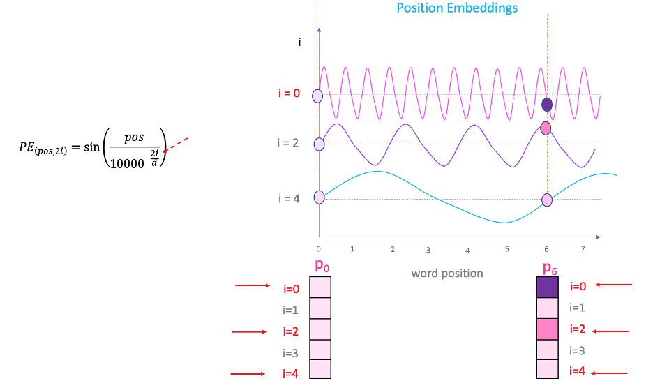

[](../../)

## [](../../main_page/GenAI)

## A Deep Dive into Rotary Positional Embeddings (RoPE)

### 1. The Problem: Why Do We Need a Better Positional Embedding?

The self-attention mechanism is permutation-invariant—it has no inherent sense of word order. The original Transformer and models like BERT and GPT-3 solve this by *adding* a learned **Absolute Positional Embedding** to each token.

This approach has two major drawbacks:



*Fig.1: How positional embedding encodes the embeddings with different frequencies along the embedding dimension and the position in the sequence. This figure relates to absolute positional embedding.*

1.  **Poor Generalization to Longer Sequences:** The model is trained on a fixed maximum sequence length (e.g., 512 or 2048). If it encounters a longer sequence at inference time, it has no learned embedding for those new positions, leading to a significant drop in performance.
2.  **Lack of Relative Position Information:** The model doesn't explicitly learn the concept of "how far apart are these two words?". It only knows that one word is at absolute position 7 and another is at absolute position 12. Encoding relative distance is less direct and must be learned implicitly by the attention heads.

The core question RoPE seeks to answer is: *Can we encode position information in a way that is inherently relative and can scale to any sequence length?*

---
### 2. The Core Intuition of RoPE: Rotation Encodes Position

Instead of adding a positional vector, RoPE's key insight is to **rotate** the Query and Key vectors based on their absolute position.

Imagine each token's embedding vector as a point in a high-dimensional space. RoPE takes this point and rotates it. The angle of rotation is determined by the token's position in the sequence.

Why is this so powerful?

Consider the dot product, which is the heart of the attention mechanism: $\langle q, k \rangle$. In 2D space, the dot product is defined as $\langle q, k \rangle = \|q\| \cdot \|k\| \cdot \cos(\alpha)$, where $\alpha$ is the angle between the vectors.

* If we take a query vector $q$ at position **m** and rotate it by an angle $\theta_m$, and we take a key vector $k$ at position **n** and rotate it by an angle $\theta_n$, the angle between the *new*, rotated vectors will be $\alpha + (\theta_m - \theta_n)$.
* The dot product between these new vectors, $\langle q', k' \rangle$, will now depend on the *relative difference* in their rotation angles, $\theta_m - \theta_n$.

If we make the rotation angle a function of the position (i.e., $\theta_m \propto m$), the attention score between two tokens becomes a function of their **relative position ($m-n$)**, not their absolute positions. This is exactly what we want.

---

### **3. Mathematical Formulation**

Let a token vector $x \in \mathbb{R}^d$ be split into $d/2$ 2D subspaces. For each such pair:

$$
    x^{(i)} = \begin{bmatrix} x_{2i} \\ x_{2i+1} \end{bmatrix}
$$

RoPE rotates each pair by a position-dependent angle:

$$
\text{RoPE}_p(x^{(i)}) = \begin{bmatrix} \cos(\theta_p^i) & -\sin(\theta_p^i) \\ \sin(\theta_p^i) & \cos(\theta_p^i) \end{bmatrix} x^{(i)}
$$

Where:

$$
\theta_p^i = \frac{p}{10000^{2i/d}}
$$

In complex form:

$$
z_p^{(i)} = x_{2i} + j x_{2i+1}, \quad \text{RoPE}_p(z^{(i)}) = z^{(i)} \cdot e^{j\theta_p^i}
$$

---

### **4. Key Properties (with Proofs)**

#### ✅ **Dot product preservation**

Let $q^{(i)}, k^{(i)} \in \mathbb{R}^2$ and apply rotation $R_\theta$ to both:

$$
\text{RoPE}_p(q^{(i)}) = R_\theta q^{(i)}, \quad \text{RoPE}_p(k^{(i)}) = R_\theta k^{(i)}
$$

Then:

$$
\langle R_\theta q^{(i)}, R_\theta k^{(i)} \rangle = q^{(i)^T} R_\theta^T R_\theta k^{(i)} = q^{(i)^T} I k^{(i)} = \langle q^{(i)}, k^{(i)} \rangle
$$

Dot product is preserved after rotation.

#### ✅ **Relative position encoding**

Apply RoPE at different positions $p, r$ to $q^{(i)}, k^{(i)}$:

$$
\text{RoPE}_p(q^{(i)}) = q^{(i)} e^{j\theta_p^i}, \quad \text{RoPE}_r(k^{(i)}) = k^{(i)} e^{j\theta_r^i}
$$

Then attention score is:

$$
\text{dot}(\text{RoPE}_p(q), \text{RoPE}_r(k)) = \sum_i \text{Re}(q^{(i)} \cdot \overline{k^{(i)}} e^{j(\theta_p^i - \theta_r^i)})
$$

So attention score depends only on **relative position** $p - r$.

---

### **5. Implementation in PyTorch**

```python
import torch
import math

def build_theta(seq_len, dim):
    half_dim = dim // 2
    freqs = 1.0 / (10000 ** (torch.arange(0, half_dim) / half_dim))
    positions = torch.arange(seq_len).unsqueeze(1)
    angles = positions * freqs.unsqueeze(0)
    return angles

def apply_rope(x, theta):
    x1, x2 = x[..., 0::2], x[..., 1::2]
    cos = torch.cos(theta)
    sin = torch.sin(theta)
    x_rope_even = x1 * cos - x2 * sin
    x_rope_odd  = x1 * sin + x2 * cos
    return torch.stack((x_rope_even, x_rope_odd), dim=-1).flatten(-2)

# Example
seq_len = 4
x = torch.randn(seq_len, 8)
theta = build_theta(seq_len, 8)
x_rope = apply_rope(x, theta)
```

---

### **6. Visualizing the Rotation**

```python
import matplotlib.pyplot as plt

for p in range(seq_len):
    angle = theta[p, 0].item()
    plt.plot([0, math.cos(angle)], [0, math.sin(angle)], label=f"p={p}")

plt.legend()
plt.title("RoPE Rotation in First 2D Subspace")
plt.gca().set_aspect('equal')
plt.show()
```


### **7. Handling Arbitrary Lengths**

#### 📌 Absolute Positional Embeddings

Let the positional embedding at position $p$ be $PE(p) \in \mathbb{R}^d$.

* If **learned**, $PE(p)$ comes from a table of shape $L \times d$, where $L$ is the maximum position seen during training.
* If **sinusoidal**, $PE(p)$ is analytically defined (e.g., via sine/cosine functions), but still encodes **absolute** position.

The modified query and key become:

$$
q' = q + PE(p), \quad k' = k + PE(r)
$$

And their dot-product:

$$
\text{score}(q', k') = (q + PE(p))^\top (k + PE(r)) = q^\top k + q^\top PE(r) + PE(p)^\top k + PE(p)^\top PE(r)
$$

This depends on $p$ and $r$ individually, not just their difference. Therefore, absolute embeddings cannot generalize to unseen positions $p > L$, because either:

* $PE(p)$ is undefined (learned embeddings), or
* the pattern does not extrapolate meaningfully (sinusoidal embeddings alias and oscillate).

---

#### ✅ Rotary Positional Embeddings (RoPE)

For RoPE:

$$
\text{RoPE}_p(q^{(i)}) = q^{(i)} e^{j \theta_p^i}, \quad \text{RoPE}_r(k^{(i)}) = k^{(i)} e^{j \theta_r^i}
$$

where $\theta_p^i = \frac{p}{10000^{2i/d}}$.

The dot-product becomes:

$$
\sum_i \text{Re}\left( q^{(i)} \cdot \overline{k^{(i)}} e^{j(\theta_p^i - \theta_r^i)} \right)
$$

This depends only on $p - r$, i.e., **relative distance**, not absolute positions.

✅ RoPE advantages:

* No learned table or fixed size
* Continuous and computable for arbitrary $p$
* Naturally generalizes to longer sequences unseen during training

So RoPE supports:

* Arbitrary sequence lengths at inference
* No memory overhead for long contexts
* Direct computation via functional form

---


### **8. Benefits Over Sinusoidal Embeddings**

| Property                        | Sinusoidal  | RoPE                     |
| ------------------------------- | ----------- | ------------------------ |
| Absolute Encoding               | ✅ Yes       | ❌ No                     |
| Relative Position Aware         | ❌ No        | ✅ Yes                    |
| Rotation-Preserving Dot Product | ❌           | ✅                        |
| Suitable for Long Contexts      | ⚠️ Limited  | ✅ Very Good              |
| Supports Arbitrary Length       | ❌ Fixed max | ✅ Yes                    |
| Used In                         | GPT-2, BERT | GPT-NeoX, LLaMA, ChatGPT |

---


### 9. Why RoPE is Important

1.  **Scalability to Sequence Length:** Because it encodes relative position, RoPE can generalize to sequence lengths much longer than it was trained on without any issues. This is a massive advantage over absolute positional embeddings.
2.  **Improved Performance:** RoPE has consistently shown strong performance, becoming a standard component in many state-of-the-art LLMs, including the Llama, PaLM, and Mistral families.
3.  **No Learned Parameters:** The positional information is injected via a deterministic function, adding no extra parameters to be learned during training.
4.  **Retains Long-Range Context:** The use of low-frequency rotations for some dimensions allows the model to effectively keep track of long-range dependencies in the text.

In conclusion, RoPE is a sophisticated and highly effective solution to one of the Transformer's original challenges, enabling models to be more flexible, robust, and powerful.

### 10. Order of Operation in RoPE  

The RoPE transformation is applied **after** projecting the input embeddings with the $W_Q$ and $W_K$ matrices, but **before** the dot product between the Query and Key vectors is calculated.

Crucially, it is **not applied to the Value vector** at all.

### Step-by-Step Data Flow

Let's trace the data flow for a single token representation, $x_m$, at position `m` as it enters a self-attention block:

1.  **Input:** We start with the token representation $x_m$ from the previous layer. This vector is considered "position-unaware" at this stage.

2.  **Projection (Creating Q, K, and V):** The first step within the attention block is to project $x_m$ into the Query, Key, and Value spaces using their respective learned weight matrices.
    * $q_m = x_m W_Q$
    * $k_m = x_m W_K$
    * $v_m = x_m W_V$

    At this point, we have three distinct vectors representing the token's role as a query, a key, and its actual content. They still do not have explicit relative position information.

3.  **Apply RoPE (The Crucial Step):** Now, we apply the rotary positional transformation, $R_m$, *only* to the Query and Key vectors.
    * $q'_m = R_m q_m$
    * $k'_m = R_m k_m$
    * The value vector, $v_m$, **is left unchanged.**

4.  **Calculate Attention Scores:** The attention scores are calculated using the **rotated**, position-aware Query and Key vectors. For the interaction between tokens at position `m` and `n`:
    $$\text{score}_{mn} \propto \langle q'_m, k'_n \rangle$$

5.  **Aggregate Values:** The resulting position-aware attention weights are then used to aggregate the **original, un-rotated** Value vectors.
    $$\text{output}_m = \sum_n \text{softmax}(\text{scores})_{mn} \cdot v_n$$

### Rationale for this Order

This specific order is deliberate and highly effective for two main reasons:

1.  **Role Specialization:** The projection matrices $W_Q$ and $W_K$ have the job of transforming the general token representation `x` into a vector space that is specialized for "querying" and "keying." RoPE's job is to then embed positional geometry into this specialized space. Applying the rotation *after* the projection allows each transformation to do its job cleanly.

2.  **Separation of Relevance and Content:** This design perfectly isolates the two functions of attention.
    * The Q-K interaction, now modified by RoPE, computes a relevance score that is a function of both content and relative position.
    * The V vector remains a pure representation of the token's content, free of positional artifacts.

This ensures that we are using position-aware weights to aggregate position-unaware content, which is the central philosophy behind RoPE's design and success.

### 10. Important Visualization

1- In Absolute positional Embedding, we apply the encoding to all $K$, $Q$, and $V$, however, in Rope we apply the encoding only on $K$ and $Q$.

2- In Absolute positional Embedding, the encoding happens before applying the projection matrices $W_Q$ and $W_k$ and $W_v$ but in Rope we apply the positional embedding after applying the projection matrices to $Q$ and $K$.

The distinction arises from the fundamental design differences between **absolute positional embeddings** (like in the original Transformer) and **Rotary Position Embedding (RoPE)**, particularly in how they integrate positional information into the attention mechanism. Below is a clear breakdown:

#### 1. **Absolute Positional Embeddings (e.g., Original Transformer)**
   - **Mechanism**:  
     Positional embeddings (e.g., sine/cosine or learned) are **added directly to the input token embeddings** before computing queries ($Q$), keys ($K$), and values ($V$).  
     - Input: $\text{Input} = \text{Token Embedding} + \text{Positional Embedding}$  
     - Then: $Q, K, V$ are derived from this modified input via linear projections.  
   - **Why Values ($V$) are Position-Encoded**:  
     Since positional embeddings are fused into the input *before* $Q$, $K$, and $V$ are computed, **all three vectors inherently carry positional information**. This ensures the value vectors ($V$) are "position-aware" during the attention-weighted aggregation.  
     - **Intuition**: The value vector represents the token's content *in its positional context*. Positional info in $V$ helps preserve location-specific nuances when aggregating values.

---

#### 2. **Rotary Position Embedding (RoPE)**
   - **Mechanism**:  
     RoPE applies a **rotation transformation** directly to $Q$ and $K$ vectors *after* they are projected from token embeddings. This rotation encodes relative positional information into $Q$ and $K$ via rotation matrices.  
     - **Input**: Raw token embeddings (no positional addition).  
     - **Transform**:  
       - $Q$ and $K$ are rotated based on their positions: $Q_{\text{rot}} = f(Q, m)$, $K_{\text{rot}} = f(K, n)$ (for positions $m$, $n$).  
       - $V$ **remains unchanged**.  
   - **Why Values ($V$) are NOT Position-Encoded**:  
     1. **Role in Attention**:  
        - The attention score $A_{mn} = Q_m^\top K_n$ depends *only* on $Q$ and $K$. RoPE encodes relative positions $(m-n)$ into $Q_m^\top K_n$ via rotational invariance.  
        - $V$ vectors are merely **weighted by the attention scores** $\text{softmax}(A)$. They do not participate in position-dependent interactions.  
        - **Key Insight**: Once attention weights are computed (using position-aware $Q/K$), they already capture how much each value should contribute *based on position*. Adding positional info to $V$ is redundant.  
     2. **Preserving Information Integrity**:  
        - $V$ represents the token's semantic content. Rotating $V$ could distort this information, as rotations are optimized for preserving relative positions in dot products ($Q^\top K$), not for representing content.  
     3. **Efficiency and Simplicity**:  
        - Omitting $V$ rotation reduces computation and aligns with RoPE's goal: inject positional info *only where necessary* (i.e., the $Q^\top K$ interaction).  

---

#### **Why the Difference? Core Philosophy**
- **Absolute Embeddings**:  
  Positional info is treated as part of the input's identity. Thus, it propagates to $Q$, $K$, *and* $V$ to ensure all components are location-sensitive.  
- **RoPE**:  
  Positional info is a *relational bias* for attention scores. It only modifies $Q$ and $K$ to make $Q_m^\top K_n$ position-dependent. $V$ remains a pure content vector, as the position-aware attention weights suffice for context aggregation.  

#### **Supporting Evidence from RoPE Paper**
The original RoPE paper ([Su et al., 2021](https://arxiv.org/abs/2104.09864)) explicitly states:
> "We only apply the rotary embedding to the query and key vectors. [...] Since the attention score is computed by the query and key, the rotary embedding is only applied to them."  

This design choice is validated empirically—RoPE achieves superior performance without rotating $V$.

#### **Key Takeaway**
RoPE avoids rotating $V$ because:  
1. Positional dependencies are fully handled in $Q^\top K$.  
2. $V$'s role is content representation, not position interaction.  
3. Efficiency: Fewer operations without sacrificing expressiveness.  

In contrast, absolute embeddings modify $V$ because positional info is baked into the input before $Q/K/V$ projection.
