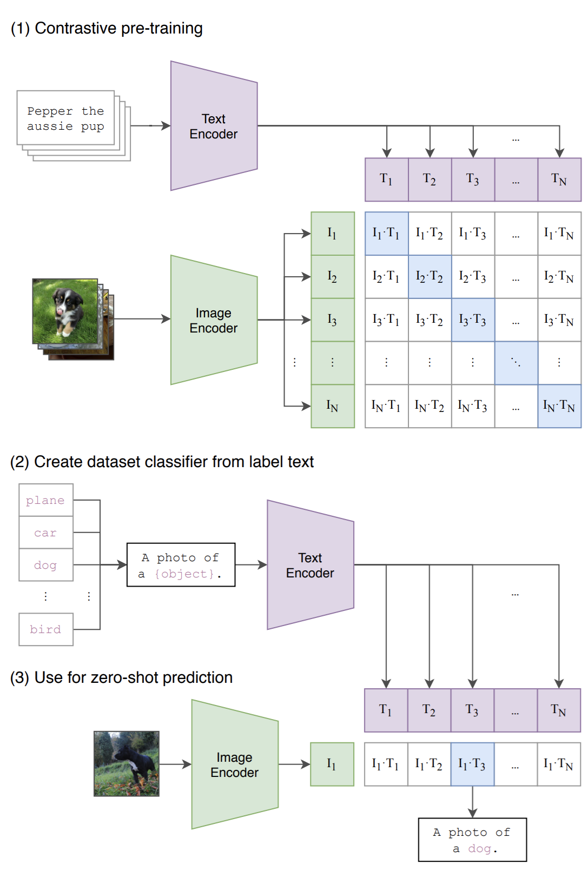

## [](../)

## [](../main_page/CV)
## [](VLMs)


### A Complete Guide to CLIP: Bridging Vision and Language with Contrastive Learning

#### **The Core Idea - What is CLIP?**

Before CLIP (Contrastive Language-Image Pre-training), the dominant approach to computer vision was supervised learning on massive, manually labeled datasets like ImageNet. A model would be trained to classify an image into one of a *fixed* set of predefined categories (e.g., 1000 classes like "golden retriever," "toaster," "container ship"). This approach had two major weaknesses:

1.  **Enormous Cost:** Creating these large, curated datasets is incredibly expensive and time-consuming.
2.  **Limited Scope:** The model's knowledge is confined to the specific categories it was trained on. It cannot classify or understand concepts outside of its training labels.

**CLIP's Breakthrough Idea:**
Instead of learning from a fixed set of labels, CLIP learns from the vast, messy, and abundant data available on the internet. It leverages the fact that millions of images online already have associated text—alt-text, captions, surrounding paragraphs, etc.

The goal of CLIP is not to predict a specific class label, but to learn the direct **relationship between an image and the text that describes it**. It learns to create a shared "map of meaning" where a picture of a puppy and the sentence "a photo of a cute puppy" are placed very close together. This flexible, semantic understanding is what gives CLIP its remarkable capabilities.



*Fig 1. While standard image models jointly train an image feature extractor and a linear classifier to predict
some label, CLIP jointly trains an image encoder and a text encoder to predict the correct pairings of a batch of (image, text) training
examples. At test time the learned text encoder synthesizes a zero-shot linear classifier by embedding the names or descriptions of the
target dataset’s classes.*

#### **The CLIP Architecture - A Tale of Two Towers**

CLIP uses a **Dual Encoder** architecture. It has two distinct models, or "towers," that process their respective modalities independently.

1.  **The Vision Model (Image Encoder)**

      * **Purpose:** To take an image as input and distill its visual content into a single, representative vector.
      * **Structure:** The CLIP authors experimented with several architectures. The two most famous are:
          * **ResNet:** A standard Convolutional Neural Network (CNN) architecture.
          * **Vision Transformer (ViT):** A more modern architecture that divides an image into patches and uses the Transformer's self-attention mechanism to process them. The ViT-based CLIP models are generally the most powerful.
      * **Input:** A raw image (e.g., 224x224 pixels).
      * **Output:** A single feature vector (an image embedding).
        
2. **The Language Model (Text Encoder)**

   * **Purpose:** To take a string of text as input and distill its semantic meaning into a single vector.

   * **Structure:** A standard, multi-layered Transformer model. It processes text tokens and uses self-attention to build a contextual understanding of the input sentence.

   * **Input:** A sequence of text tokens.

   * **Output:** A single feature vector (a text embedding), typically derived from the final state of the `[EOS]` (End of Sequence) token.

     **Why not the `[CLS]` token or Pooling?**

     **`[CLS]` Token:** The `[CLS]` token is a convention made famous by **BERT**. In BERT-style models, a `[CLS]` token is placed at the *beginning* of the sequence, and its final hidden state is typically used for classification tasks. CLIP's text encoder, while being a Transformer, follows a different design choice more akin to the GPT family, which focuses on sequence completion and uses an end token.

     **Pooling:** Another common strategy is to take the final hidden states of *all* tokens in the sequence and average them (mean pooling) or take the maximum value across each dimension (max pooling). This can sometimes create a more holistic representation. However, the CLIP authors found that simply using the `[EOS]` token's output was effective and sufficient for their contrastive learning objective.

     So, to summarize: **CLIP uses the `[EOS]` token's output vector** as the final text embedding before it is passed to the projection head.


3.  **The Projection Head**
    This is a crucial but often overlooked component. The raw output vectors from the image and text encoders are not directly compared. Instead, they are first passed through a small **projection head** (a simple multi-layer perceptron or MLP). This head projects the features from each modality into a shared, lower-dimensional embedding space where the contrastive loss is calculated.

#### **The Mathematics of Alignment**

**Embeddings and Normalization**

Let's say after passing an image $I$ and a text $T$ through their respective encoders and projection heads, we get the feature vectors $I_f$ and $T_f$.

A key step in CLIP is **L2 Normalization**. The final embeddings, $I_e$ and $T_e$, are normalized to have a unit length (a magnitude of 1).

$$
I_e = \frac{I_f}{\|I_f\|_2} \quad \text{and} \quad T_e = \frac{T_f}{\|T_f\|_2}
$$

  * **Why is this important?** When two vectors are L2-normalized, their **dot product** is mathematically identical to their **cosine similarity**.

    $$
    \text{similarity} = \cos(\theta) = \frac{I_e \cdot T_e}{\|I_e\| \|T_e\|} = \frac{I_e \cdot T_e}{1 \cdot 1} = I_e \cdot T_e
    $$

    This simplifies the math and makes the dot product a clean measure of similarity, bounded between -1 (opposite meaning) and +1 (identical meaning).

**The Contrastive Loss Function (InfoNCE)**

The core of CLIP's training is a contrastive loss function, specifically a symmetric version of InfoNCE (Noise-Contrastive Estimation).

  * **The Setup:** Imagine a training batch with $N$ image-text pairs: $(I_1, T_1), (I_2, T_2), \ldots, (I_N, T_N)$.

  * **The Similarity Matrix:** After getting the $N$ image embeddings and $N$ text embeddings, we compute the dot product between every image and every text. This gives us an $N \times N$ matrix of similarity scores.

    ```
         T_1   T_2   ...  T_N
    I_1 [s_11, s_12, ..., s_1N]
    I_2 [s_21, s_22, ..., s_2N]
    ...
    I_N [s_N1, s_N2, ..., s_NN]
    ```

  * **The Goal:** The scores on the diagonal ($s_11, s_22, \ldots$) represent the similarity of the *correct* pairs. All other, off-diagonal scores represent incorrect pairs. The training objective is to maximize the scores on the diagonal while minimizing all off-diagonal scores.

  * **The Math:** This is framed as a classification problem. For a given image $I_i$, the model must correctly classify which of the $N$ texts is its true partner. The probability is calculated using a softmax over the similarity scores.

    $$
    \mathcal{L}_{\text{image}} = -\log \frac{\exp\left(\frac{\text{sim}(I_i, T_i)}{\tau}\right)}{\sum_{j=1}^{N} \exp\left(\frac{\text{sim}(I_i, T_j)}{\tau}\right)}
    $$

      * $\text{sim}(I, T)$ is the dot product $I_e \cdot T_e$.
      * $\tau$ is a **learnable temperature parameter**. It scales the logits before the softmax. A lower temperature makes the distribution sharper, forcing the model to work harder to distinguish between similar items.

    This is just the standard **cross-entropy loss**, where the "logits" are the similarity scores and the "ground truth label" for $I_i$ is its corresponding text $T_i$.

    Since the problem is symmetric, we also calculate the loss for the texts:

    $$
    \mathcal{L}_{\text{text}} = -\log \frac{\exp\left(\frac{\text{sim}(T_i, I_i)}{\tau}\right)}{\sum_{j=1}^{N} \exp\left(\frac{\text{sim}(T_i, I_j)}{\tau}\right)}
    $$

    The **final loss** for the entire batch is the average of these two components:
 
    $$
    \mathcal{L}_{\text{CLIP}} = \frac{L_{\text{image}} + L_{\text{text}}}{2}
    $$

#### **The Training Process**

  * **Dataset:** CLIP was trained on a massive, custom dataset of **400 million (image, text) pairs** scraped from the public internet. The key insight was that this data, while noisy, was diverse and plentiful enough to learn robust representations.
  * **Input-Output Pairs:** The training input is simply an `(image, text)` pair. There are no explicit class labels. The text itself serves as the "label" for the image. The training output is the optimized weights for the image encoder, text encoder, and their projection heads.

**Conceptual Training Code Snippet**

This code uses NumPy to illustrate the core logic of the loss calculation. In a real implementation, PyTorch or TensorFlow would handle the model definitions and automatic differentiation.

```python
import numpy as np

# --- Placeholder for actual model encoders ---
def image_encoder(image):
    # In reality, this is a ResNet or ViT
    return np.random.randn(512) # Example embedding dimension

def text_encoder(text):
    # In reality, this is a Transformer
    return np.random.randn(512)

def l2_normalize(vec):
    return vec / np.linalg.norm(vec)

def train_clip_step(image_batch, text_batch, temperature=0.07):
    """A single conceptual training step for CLIP."""
    
    # Get embeddings from the two towers
    image_features = np.array([image_encoder(img) for img in image_batch])
    text_features = np.array([text_encoder(txt) for txt in text_batch])
    
    # L2-normalize the features to get the final embeddings
    image_embeddings = np.array([l2_normalize(f) for f in image_features])
    text_embeddings = np.array([l2_normalize(f) for f in text_features])
    
    # Calculate the N x N similarity matrix
    # The dot product of normalized vectors is the cosine similarity
    similarity_matrix = np.dot(image_embeddings, text_embeddings.T)
    
    # The temperature scaling
    logits = similarity_matrix / temperature
    
    # --- The Loss Calculation (Symmetric Cross-Entropy) ---
    # We want to match images to texts (labels are the diagonal: 0, 1, 2...)
    # and texts to images (labels are also the diagonal).
    
    N = len(image_batch)
    labels = np.arange(N)
    
    # Image-to-Text Loss
    # For each image, what is the probability it matches the correct text?
    exp_logits_img = np.exp(logits)
    probs_img = exp_logits_img / np.sum(exp_logits_img, axis=1, keepdims=True)
    loss_i = -np.mean([np.log(probs_img[i, labels[i]]) for i in range(N)])
    
    # Text-to-Image Loss
    # For each text, what is the probability it matches the correct image?
    # We can do this by transposing the logits matrix
    exp_logits_txt = np.exp(logits.T)
    probs_txt = exp_logits_txt / np.sum(exp_logits_txt, axis=1, keepdims=True)
    loss_t = -np.mean([np.log(probs_txt[i, labels[i]]) for i in range(N)])
    
    # Total Loss
    total_loss = (loss_i + loss_t) / 2
    
    # In a real framework, you would now call:
    # total_loss.backward()
    # optimizer.step()
    
    return total_loss

# Example usage
dummy_images = ["img1.jpg", "img2.jpg", "img3.jpg"] # Representing image data
dummy_texts = ["a photo of a dog", "a drawing of a cat", "an airplane in the sky"]
loss = train_clip_step(dummy_images, dummy_texts)
print(f"Conceptual CLIP Loss for one batch: {loss:.4f}")

```

#### **Inference - Putting CLIP to Work**

Once trained, CLIP's encoders are incredibly versatile.

**Application 1: Zero-Shot Image Classification**

This is CLIP's most famous capability. You can classify images into categories the model has never been explicitly trained on.

  * **The Process:**

    1.  Take an image you want to classify (e.g., a picture of a cat).
    2.  Encode it using the `image_encoder` to get its embedding, $I_e$.
    3.  Define your candidate classes as text prompts. It's crucial to provide some context, so instead of `["dog", "cat"]`, use `["a photo of a dog", "a photo of a cat"]`.
    4.  Encode each text prompt using the `text_encoder` to get a set of text embeddings, $T_{e_1}, T_{e_2}, \ldots$.
    5.  Calculate the cosine similarity between the image embedding $I_e$ and each text embedding.
    6.  The text prompt with the highest similarity score is the predicted label for the image.

  * **Example Code:**

```python
def zero_shot_classify(image, text_labels):
    """Classifies an image using CLIP's zero-shot capability."""
    
    # Encode the image and normalize
    image_embedding = l2_normalize(image_encoder(image))
    
    # Create prompts and encode the text labels
    prompts = [f"a photo of a {label}" for label in text_labels]
    text_embeddings = np.array([l2_normalize(text_encoder(p)) for p in prompts])
    
    # Calculate similarities
    similarities = np.dot(image_embedding, text_embeddings.T)
    
    # Find the best match
    best_match_index = np.argmax(similarities)
    predicted_label = text_labels[best_match_index]
    confidence = similarities[best_match_index]
    
    return predicted_label, confidence

# Usage
my_image = "path/to/my_cat_image.jpg"
classes = ["dog", "cat", "car", "tree"]
label, score = zero_shot_classify(my_image, classes)
print(f"Predicted Label: {label} (Confidence: {score:.2f})")
```

**Application 2: Image-Text Retrieval (Semantic Search)**

You can use CLIP to build a search engine that finds images based on a natural language description.

  * **The Process:**

    1.  **Offline:** Pre-compute and store the image embeddings for your entire image database.
    2.  **Online:** When a user provides a text query (e.g., "two dogs playing in a park"), encode it with the `text_encoder`.
    3.  Use this text embedding to perform a similarity search (like FAISS) against your pre-computed image embedding database.
    4.  Return the top N images with the highest similarity scores.

  * **Example Code:**

<!-- end list -->

```python
# Assume image_db_embeddings is a pre-computed NumPy array of N x 512 embeddings
# image_db_filenames is a list of corresponding filenames

def search_images(text_query, image_db_embeddings, image_db_filenames, top_k=5):
    """Searches an image database with a text query using CLIP."""
    
    # Encode the query and normalize
    query_embedding = l2_normalize(text_encoder(text_query))
    
    # Calculate similarity against the entire database
    similarities = np.dot(image_db_embeddings, query_embedding)
    
    # Get the indices of the top_k most similar images
    top_k_indices = np.argsort(similarities)[::-1][:top_k]
    
    # Return the filenames of the best matches
    return [image_db_filenames[i] for i in top_k_indices]

# # Example Usage:
# results = search_images("A red car driving on a coastal road", db_embs, db_files)
# print("Search results:", results)
```

#### **Reference**

CLIP's impact on the field cannot be overstated. It demonstrated a new, scalable paradigm for training flexible vision models that understand language on a deep, semantic level.

  * **Official Paper:** Radford, A., Kim, J. W., Hallacy, C., Ramesh, A., Goh, G., Agarwal,S., Sastry, G., Askell, A., Mishkin, P., Clark, J., Krueger, G., & Sutskever, I. (2021). *Learning Transferable Visual Models From Natural Language Supervision*. [arXiv:2103.00020](https://arxiv.org/abs/2103.00020).
