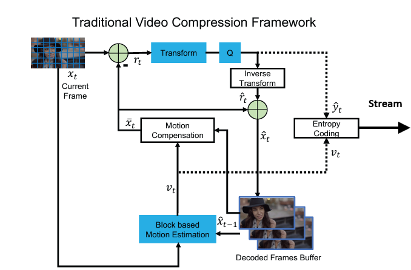

[](../)

## **Comprehensive Tutorial on Traditional Video Compression**

This tutorial explains the entire workflow of traditional video compression, combining motion estimation, motion compensation (including warping), residual calculation, DCT transformation, quantization, and encoding. We'll add **mathematical relationships** between the blocks to provide a deeper understanding.

---
Hello
 
### **Overview of Video Compression**
The goal of video compression is to reduce the size of video data while preserving perceptual quality. This is achieved by exploiting spatial and temporal redundancies in video frames.

---

### **Step-by-Step Compression Workflow**

#### **1. Frame Separation**
- A video is a sequence of frames. Frames are divided into:
  - **Keyframes (Intra-frames):** Compressed independently using spatial techniques (e.g., DCT).
  - **Predicted Frames (Inter-frames):** Compressed using motion estimation and compensation to exploit temporal redundancy.

#### **Mathematical Representation**
Let $$F_t$$ be the frame at time $$t$$. The predicted frame, $$\hat{F}_t$$, is derived from a reference frame $$F_{t-1}$$:
$$
\hat{F}_t = \text{Warp}(F_{t-1}, V_t)
$$
Where $$V_t$$ represents the motion vectors (derived during motion estimation).

---

#### **2. Motion Estimation**
- Motion estimation identifies how blocks in the current frame $$F_t$$ move relative to a reference frame $$F_{t-1}$$.
- Frames are divided into non-overlapping blocks (e.g., $$B_{i,j}$$, a block at position$$(i, j)\)).
- For each block in $$F_t$$, find the best match in $$F_{t-1}$$ using a **block matching algorithm**:
  $$
  V_{i,j} = \arg \min_{(dx, dy)} \| B_{i,j} - B_{i+dx,j+dy} \|^2
  $$
  where $$V_{i,j} = (dx, dy)$$ is the motion vector for block $$B_{i,j}$$.

---

#### **3. Motion Compensation (with Warping)**
- Using motion vectors $$V_{i,j}$$, motion compensation generates a **predicted frame $$\hat{F}_t$$**:
  $$
  \hat{B}_{i,j} = F_{t-1}(i+dx, j+dy)
  $$
  where $$F_{t-1}(i+dx, j+dy)$$ is the block in the reference frame displaced by the motion vector.

- **Warping:** For more complex motion (e.g., rotation or scaling), apply geometric transformations:
  $$
  \hat{F}_t(x, y) = F_{t-1}(M \cdot [x, y]^T)
  $$
  where $$M$$ is the transformation matrix representing scaling, rotation, or translation.

---

#### **4. Residual Calculation**
- The **residual frame** captures the difference between the actual frame $$F_t$$ and the predicted frame $$\hat{F}_t$$:
  $$
  R_t = F_t - \hat{F}_t
  $$
- The residual frame contains the information that motion compensation cannot capture (e.g., occlusions, texture changes).

---

#### **5. Discrete Cosine Transform (DCT)**
- The residual frame $$R_t$$ is transformed into the frequency domain using the DCT. The DCT separates the image into:
  - **Low-frequency components:** Represent large-scale features.
  - **High-frequency components:** Represent fine details.
- For each block $$B_{i,j}$$ in $$R_t$$, the DCT transformation is:
  $$
  D(u, v) = \frac{1}{4} \sum_{x=0}^{N-1} \sum_{y=0}^{N-1} R_t(x, y) \cdot \cos\left[\frac{(2x+1)u\pi}{2N}\right] \cdot \cos\left[\frac{(2y+1)v\pi}{2N}\right]
  $$
  where $$N$$ is the block size (e.g., $$8 \times 8$$).

---

#### **6. Quantization**
- The DCT coefficients $$D(u, v)$$ are quantized to reduce precision, making the data more compressible:
  $$
  Q(u, v) = \text{round}\left(\frac{D(u, v)}{Q_{\text{matrix}}(u, v)}\right)
  $$
  where $$Q_{\text{matrix}}(u, v)$$ is the quantization matrix (e.g., JPEG standard matrix). Higher frequencies (small details) are quantized more aggressively.

---

#### **7. Entropy Encoding**
- Quantized coefficients $$Q(u, v)$$ are encoded using entropy coding (e.g., Huffman or arithmetic coding) to further reduce redundancy.
- Symbols (e.g., quantized values) are represented with shorter codes for frequent values and longer codes for rare values.

---

### **Putting It All Together**

#### **Overall Mathematical Workflow**
1. **Input Video Frames:**
   - Frames $$F_t$$ and $$F_{t-1}$$.
2. **Motion Estimation:**
   - Compute motion vectors $$V_t$$ for all blocks.
   $$
   V_t = \arg \min_{(dx, dy)} \| B_t - B_{t-1} \|^2
   $$
3. **Motion Compensation (Warping):**
   - Generate predicted frame:
   $$
   \hat{F}_t(x, y) = F_{t-1}(M \cdot [x, y]^T)
   $$
4. **Residual Calculation:**
   - Compute residual:
   $$
   R_t = F_t - \hat{F}_t
   $$
5. **DCT Transformation:**
   - Transform residual to frequency domain:
   $$
   D(u, v) = \frac{1}{4} \sum_{x=0}^{N-1} \sum_{y=0}^{N-1} R_t(x, y) \cdot \cos\left[\frac{(2x+1)u\pi}{2N}\right] \cdot \cos\left[\frac{(2y+1)v\pi}{2N}\right]
   $$
6. **Quantization:**
   - Quantize the DCT coefficients:
   $$
   Q(u, v) = \text{round}\left(\frac{D(u, v)}{Q_{\text{matrix}}(u, v)}\right)
   $$
7. **Entropy Encoding:**
   - Compress quantized coefficients using Huffman coding.

---

### **Complete Pseudo-Code**
```pseudo
# Motion Estimation
for each block in current_frame:
    motion_vector = block_matching(reference_frame, current_block)

# Motion Compensation with Warping
for each block in reference_frame:
    predicted_block = apply_warping(reference_block, motion_vector)
    predicted_frame += predicted_block

# Residual Calculation
residual_frame = current_frame - predicted_frame

# DCT Transformation
for each block in residual_frame:
    dct_coefficients[block] = apply_dct(residual_frame[block])

# Quantization
for each coefficient in dct_coefficients:
    quantized_coefficients[block] = round(dct_coefficients[block] / quantization_matrix)

# Entropy Encoding
compressed_data = huffman_encode(quantized_coefficients)
```

---

### **Visualization of Workflow**
1. **Input Frame:** Current and reference frames.
2. **Motion Estimation:** Compute motion vectors.
3. **Motion Compensation:** Warp reference frame to create predicted frame.
4. **Residual Calculation:** Subtract predicted frame from actual frame.
5. **Transform & Quantization:** Apply DCT and quantize coefficients.
6. **Encoding:** Compress quantized coefficients.

This comprehensive flow reduces video size while maintaining high perceptual quality, forming the foundation of codecs like MPEG, H.264, and H.265. Let me know if you'd like visual aids or additional explanations!
